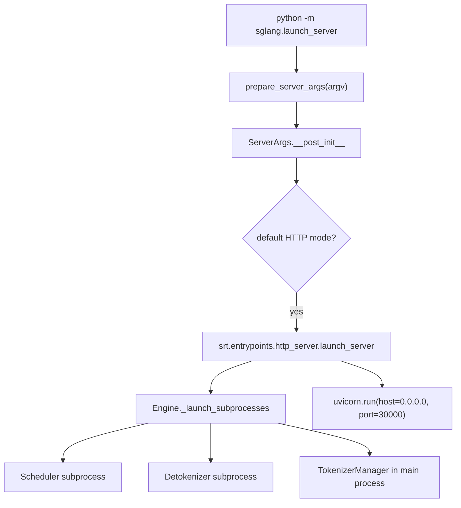
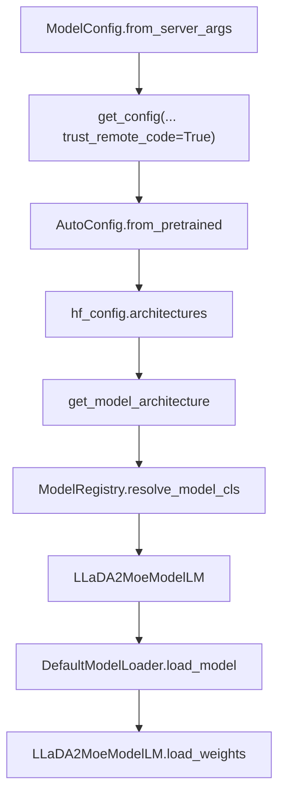
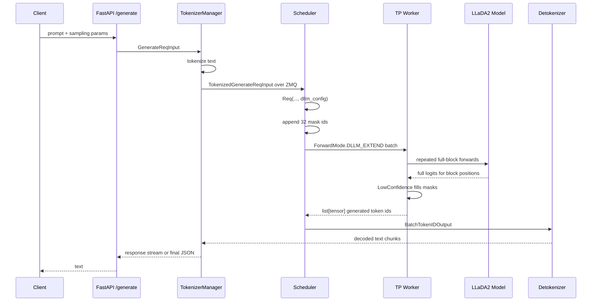
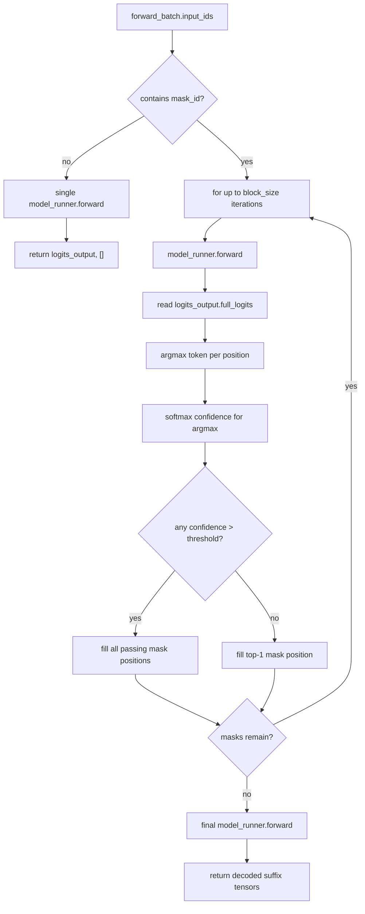
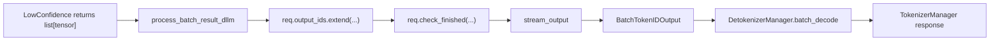
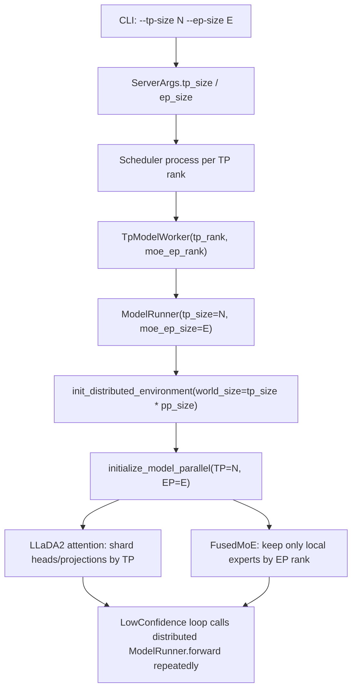

# LLaDA2 LowConfidence Launch Walkthrough
## Context
Command studied:
```bash
python -m sglang.launch_server \
  --model-path inclusionAI/LLaDA2.0-mini \
  --dllm-algorithm LowConfidence \
  --host 0.0.0.0 \
  --port 30000 \
  --trust-remote-code
```
This note explains the SGLang SRT text-generation server path for LLaDA2 diffusion-LLM serving. It is based on the local checkout under `/root/sglang_a100/sglang`; the server was not launched and the model was not downloaded.
## One-Screen Mental Model
```text
CLI flags
  |
  v
ServerArgs
  |  model_path=inclusionAI/LLaDA2.0-mini
  |  dllm_algorithm=LowConfidence
  |  trust_remote_code=True
  v
HTTP SRT server
  |
  +--> main process: FastAPI/Uvicorn + TokenizerManager
  |
  +--> subprocess: Scheduler + TP worker + ModelRunner + LLaDA2MoeModelLM
  |
  +--> subprocess: DetokenizerManager
```
The important dLLM shift is that serving is not ordinary "append one next token" decoding. SGLang appends a block of mask tokens, repeatedly forwards the block, and fills selected mask positions according to confidence.
## Launch-Time Flow

| Stage | Key file | What happens |
|---|---|---|
| Module entry | `python/sglang/launch_server.py:53` | Loads plugins, parses args, calls `run_server`. |
| HTTP routing choice | `python/sglang/launch_server.py:46` | Selects normal SRT HTTP server path. |
| CLI fields | `python/sglang/srt/server_args.py:355` | Defines `model_path`, `trust_remote_code`, `host`, `port`. |
| DLLM flags | `python/sglang/srt/server_args.py:6328` | Registers `--dllm-algorithm` and config file option. |
| HTTP runtime | `python/sglang/srt/entrypoints/http_server.py:2315` | Documents HTTP + tokenizer + scheduler + detokenizer topology. |
| Uvicorn bind | `python/sglang/srt/entrypoints/http_server.py:2262` | Listens on `0.0.0.0:30000`. |
## What The Flags Do
| Flag | Stored in | Runtime effect |
|---|---|---|
| `--model-path inclusionAI/LLaDA2.0-mini` | `ServerArgs.model_path` | Used for HF config, tokenizer, weight loading, and served model identity. |
| `--dllm-algorithm LowConfidence` | `ServerArgs.dllm_algorithm` | Enables DLLM path, builds `DllmConfig`, selects `LowConfidence`. |
| `--host 0.0.0.0` | `ServerArgs.host` | Public bind address for Uvicorn. Internal helper URL maps `0.0.0.0` to `127.0.0.1`. |
| `--port 30000` | `ServerArgs.port` | HTTP port. Native gRPC port, if enabled by env, defaults to `port + 10000`. |
| `--trust-remote-code` | `ServerArgs.trust_remote_code=True` | Passed into HF `AutoConfig` and `AutoTokenizer`. |
## Model Loading Path

| Concern | File reference | Detail |
|---|---|---|
| HF config loading | `python/sglang/srt/configs/model_config.py:201` | `ModelConfig` calls `get_config(..., trust_remote_code=server_args.trust_remote_code)`. |
| HF AutoConfig | `python/sglang/srt/utils/hf_transformers/config.py:63` | Calls `AutoConfig.from_pretrained`. |
| Native registry | `python/sglang/srt/models/registry.py:94` | Imports model modules and registers their `EntryClass`. |
| Architecture resolution | `python/sglang/srt/model_loader/utils.py:195` | Resolves HF architecture to native SGLang class if supported. |
| LLaDA2 class | `python/sglang/srt/models/llada2.py:772` | Defines `LLaDA2MoeModelLM`. |
| Registry hook | `python/sglang/srt/models/llada2.py:953` | `EntryClass = LLaDA2MoeModelLM`. |
| Full logits | `python/sglang/srt/models/llada2.py:803` | `LogitsProcessor(..., return_full_logits=True)` supports block-wise DLLM token selection. |
## Model Loading Call Chain In Detail
There are two connected but different things called "model loading":
* Config/class resolution: read HF config and decide which Python model class should be constructed.
* Weight loading: instantiate that class, then load checkpoint tensors into it.
`ModelRegistry.resolve_model_cls` follows `get_model_architecture` because `get_model_architecture` is the wrapper that converts `model_config.hf_config.architectures` into a concrete Python class. It handles special cases and fallback policy, then delegates the actual name-to-class lookup to `ModelRegistry`.
### Full chain: scheduler subprocess reaches model loading
```text
Engine._launch_subprocesses
  -> Engine._launch_scheduler_processes
     -> multiprocessing.Process(target=run_scheduler_process)
        -> run_scheduler_process
           -> Scheduler.__init__
              -> Scheduler.init_model_config
                 -> ModelConfig.from_server_args
                    -> ModelConfig.__init__
                       -> get_config
                       -> get_generation_config
              -> Scheduler.init_model_worker
                 -> Scheduler.init_tp_model_worker
                    -> TpModelWorker.__init__
                       -> TpModelWorker._init_model_config
                          -> ModelConfig.from_server_args
                             -> ModelConfig.__init__
                                -> get_config
                                -> get_generation_config
                       -> TpModelWorker._init_model_runner
                          -> ModelRunner.__init__
                             -> ModelRunner.initialize
                                -> ModelRunner.load_model
```
Important detail: both `Scheduler.init_model_config` and `TpModelWorker._init_model_config` build a `ModelConfig`. The scheduler needs model metadata for scheduling limits and token validation; the TP worker needs the same config to actually construct and load the model.
### Full chain: HF config loading
```text
ModelConfig.from_server_args
  -> ModelConfig.__init__
     -> get_config(model_path, trust_remote_code=True, revision=...)
        -> get_model_config_parser("hf")  # unless auto chooses another parser
           -> HfModelConfigParser.parse
              -> AutoConfig.from_pretrained(..., trust_remote_code=True)
     -> get_generation_config(model_path, trust_remote_code=True, revision=...)
```
Output of this chain:
```text
model_config.hf_config
model_config.hf_text_config
model_config.hf_generation_config
model_config.hf_config.architectures = ["LLaDA2MoeModelLM"]  # expected for this model
```
### Direct logic: choose the model loader
The model-loader decision is local to `get_model_loader(load_config, model_config)` in `python/sglang/srt/model_loader/loader.py:3275`. This function answers: "which loader object should load the weights?"
```text
get_model_loader(load_config, model_config)
  -> if load_config.load_format == DUMMY:
       return DummyModelLoader
  -> if ModelOpt quantization is requested:
       return ModelOptModelLoader
  -> if load_config.load_format is a custom loader class:
       return load_config.load_format(load_config)
  -> if load_format == SHARDED_STATE:
       return ShardedStateLoader
  -> if load_format == BITSANDBYTES:
       return BitsAndBytesModelLoader
  -> if load_format == GGUF:
       return GGUFModelLoader
  -> if load_format == LAYERED:
       return LayeredModelLoader
  -> if load_format == FLASH_RL:
       return QuantizedRLModelLoader
  -> if load_format == REMOTE:
       return RemoteModelLoader
  -> if load_format == REMOTE_INSTANCE:
       return RemoteInstanceModelLoader
  -> if load_format == PRIVATE:
       return PrivateModelLoader
  -> if load_format == RUNAI_STREAMER:
       return RunaiModelStreamerLoader
  -> otherwise:
       return DefaultModelLoader
```
For this command, no explicit quantization or special load format is provided, so the decision falls through to:
```text
DefaultModelLoader(load_config)
```
Caller context only:
```text
ModelRunner.load_model
  -> creates LoadConfig from ServerArgs
  -> get_model_loader(load_config, model_config)
  -> self.loader.load_model(...)
```
`ModelRunner.load_model` is not the model-loader decision logic; it is just the caller that prepares `LoadConfig` and invokes `get_model_loader`.
### Full chain: choose the model class
```text
DefaultModelLoader.load_model
  -> _get_quantization_config(model_config, load_config)
     -> get_model_architecture(model_config)
        -> architectures = model_config.hf_config.architectures
        -> supported_archs = ModelRegistry.get_supported_archs()
        -> is_native_supported = any(arch in supported_archs for arch in architectures)
        -> if not native, resolve_transformers_arch(...)
        -> ModelRegistry.resolve_model_cls(architectures)
           -> ModelRegistry._normalize_archs(architectures)
           -> for arch in architectures:
                ModelRegistry._try_load_model_cls(arch)
           -> return (LLaDA2MoeModelLM, "LLaDA2MoeModelLM")
  -> _initialize_model(model_config, load_config, quant_config)
     -> get_model_architecture(model_config)
        -> ModelRegistry.resolve_model_cls(...)
     -> return model_class(config=model_config.hf_config, quant_config=quant_config)
```
This explains the ordering:
```text
get_model_architecture(...)
  prepares and normalizes architecture choice
  then calls
ModelRegistry.resolve_model_cls(...)
  performs the registry lookup from architecture string to class object
```
For LLaDA2:
```text
"LLaDA2MoeModelLM"
  -> ModelRegistry.models["LLaDA2MoeModelLM"]
  -> python/sglang/srt/models/llada2.py::LLaDA2MoeModelLM
```
### Full chain: how the registry knows LLaDA2
```text
import sglang.srt.models.registry
  -> ModelRegistry = _ModelRegistry()
  -> ModelRegistry.register("sglang.srt.models")
     -> import_model_classes("sglang.srt.models")
        -> pkgutil.iter_modules(package.__path__)
        -> importlib.import_module("sglang.srt.models.llada2")
        -> module.EntryClass
        -> model_arch_name_to_cls["LLaDA2MoeModelLM"] = LLaDA2MoeModelLM
```
The registry is populated before `get_model_architecture` asks it for supported architectures. This is why `LLaDA2MoeModelLM` is treated as a native SGLang model rather than falling back to generic Transformers backend.
### Direct answer: how `LLaDA2MoeModelLM` is registered
`LLaDA2MoeModelLM` is registered through SGLang's module-level `EntryClass` convention.
The chain is:
```text
import sglang.srt.models.registry
  -> ModelRegistry = _ModelRegistry()
  -> ModelRegistry.register("sglang.srt.models")
     -> import_model_classes("sglang.srt.models")
        -> iterate every module under python/sglang/srt/models/
        -> import sglang.srt.models.llada2
        -> see module.EntryClass
        -> register EntryClass.__name__ as key
```
For LLaDA2 specifically:
```python
# python/sglang/srt/models/llada2.py
class LLaDA2MoeModelLM(nn.Module):
    ...

EntryClass = LLaDA2MoeModelLM
```
Then the registry code effectively does:
```python
entry = module.EntryClass
model_arch_name_to_cls[entry.__name__] = entry
```
So the resulting registry entry is:
```text
ModelRegistry.models["LLaDA2MoeModelLM"] = LLaDA2MoeModelLM
```
Relevant files:
| File | Role |
|---|---|
| `python/sglang/srt/models/registry.py:94` | Iterates and imports model modules. |
| `python/sglang/srt/models/registry.py:111` | Checks whether imported module has `EntryClass`. |
| `python/sglang/srt/models/registry.py:125` | Registers `entry.__name__ -> entry`. |
| `python/sglang/srt/models/registry.py:130` | Creates `ModelRegistry`. |
| `python/sglang/srt/models/registry.py:131` | Populates it from `sglang.srt.models`. |
| `python/sglang/srt/models/llada2.py:953` | Sets `EntryClass = LLaDA2MoeModelLM`. |
### Full chain: instantiate and load weights
```text
DefaultModelLoader.load_model
  -> target_device = torch.device(device_config.device)
  -> quant_config = _get_quantization_config(...)
  -> with set_default_torch_dtype(model_config.dtype)
     -> with target_device:
        -> _initialize_model(...)
           -> model_class(...)
           -> LLaDA2MoeModelLM.__init__
              -> LLaDA2MoeModel(...)
              -> ParallelLMHead or tied word embeddings
              -> LogitsProcessor(return_full_logits=True)
     -> DefaultModelLoader.load_weights_and_postprocess(...)
        -> DefaultModelLoader._get_all_weights(...)
        -> model.load_weights(weights)
           -> LLaDA2MoeModelLM.load_weights
        -> _post_load_weights(model)
  -> return model.eval()
```
The loaded object stored at runtime is:
```text
ModelRunner.model = LLaDA2MoeModelLM(...)
```
Later, during DLLM generation:
```text
LowConfidence.run
  -> model_runner.forward
     -> model_runner.forward_extend
        -> model_runner.model.forward(...)
           -> LLaDA2MoeModelLM.forward(...)
```
## DLLM Config Snapshot
`DllmConfig.from_server_args` in `python/sglang/srt/dllm/config.py:22` inspects the model architecture and chooses diffusion-model constants.
| Architecture | Block size | Mask token id | Source |
|---|---:|---:|---|
| `LLaDA2MoeModelLM` | `32` | `156895` | `python/sglang/srt/dllm/config.py:35` |
| `SDARForCausalLM` | `4` | `151669` | `python/sglang/srt/dllm/config.py:36` |
| `SDARMoeForCausalLM` | `4` | `151669` | `python/sglang/srt/dllm/config.py:37` |
Default for this command:
```text
algorithm = LowConfidence
threshold = 0.95
block_size = 32
mask_id = 156895
max_running_requests = 1  # because --max-running-requests was not provided
```
Startup side effects:
* `python/sglang/srt/server_args.py:1336`: DLLM disables piecewise CUDA graph.
* `python/sglang/srt/server_args.py:4374`: DLLM-specific backend handling.
* `python/sglang/srt/server_args.py:4401`: overlap scheduling is disabled for DLLM.
## Request Lifecycle

## Request Object State
The request starts as ordinary token ids, then DLLM adds phase and block state.
```text
origin_input_ids = prompt tokens
output_ids       = []
dllm_block_offset = 0
dllm_phase = INCOMING_PREFILL or INCOMING_DECODE
```
At each DLLM round, `Req._init_fill_ids_for_dllm` constructs:
```text
fill_ids = origin_input_ids + output_ids + [MASK] * 32
```
Key files:
| Step | File reference | Detail |
|---|---|---|
| Request tokenization | `python/sglang/srt/managers/tokenizer_manager.py:713` | Handles text, input ids, input embeds, and multimodal cases. |
| Tokenized object | `python/sglang/srt/managers/tokenizer_manager.py:1004` | Builds `TokenizedGenerateReqInput`. |
| Send to scheduler | `python/sglang/srt/managers/tokenizer_manager.py:1182` | Sends over ZMQ. |
| Scheduler `Req` | `python/sglang/srt/managers/scheduler.py:2024` | Passes `dllm_config=self.dllm_config`. |
| DLLM request init | `python/sglang/srt/dllm/mixin/req.py:20` | Adds phase and block metadata. |
| Add mask block | `python/sglang/srt/dllm/mixin/req.py:56` | Appends `[mask_id] * block_size`. |
| DLLM batch mode | `python/sglang/srt/managers/schedule_batch.py:1688` | Sets `ForwardMode.DLLM_EXTEND`. |
## Block-Wise Denoising Example
LLaDA2 uses a block size of 32. The mask id is `156895`; this diagram writes it as `[M]`.
```text
Prompt/output prefix:
  P0 P1 P2 ... Pk

New DLLM block before LowConfidence:
  [M] [M] [M] [M] [M] [M] [M] [M] ... [M]   32 masked positions

Forward pass returns full logits for all 32 positions:
  logits[0], logits[1], ..., logits[31]

LowConfidence computes:
  pred[i] = argmax(logits[i])
  conf[i] = softmax(logits[i])[pred[i]]

If conf[i] > 0.95:
  replace [M] at i with pred[i]

If no conf[i] > 0.95:
  replace only the single highest-confidence mask position
```
Illustrative progression:
```text
iteration 0:
  [M] [M] [M] [M] [M] [M] [M] [M]

iteration 1, high-confidence positions 1 and 6:
  [M]  T1 [M] [M] [M] [M]  T6 [M]

iteration 2, high-confidence positions 0, 3, and 5:
   T0  T1 [M]  T3 [M]  T5  T6 [M]

...

done:
   T0  T1  T2  T3  T4  T5  T6  T7
```
This is not append-only autoregressive decoding. Already filled positions remain in the same block, and remaining masked positions are reconsidered using the updated block content.
## LowConfidence Algorithm Map

Code anchor: `python/sglang/srt/dllm/algorithm/low_confidence.py:23`.
| Operation | Code area |
|---|---|
| Find mask positions | `low_confidence.py:32` |
| Fast path with no masks | `low_confidence.py:34` |
| Compute per-block start positions | `low_confidence.py:42` |
| Repeated forward loop | `low_confidence.py:51` |
| Argmax and confidence | `low_confidence.py:72` |
| Threshold selection | `low_confidence.py:84` |
| Forced top-1 fallback | `low_confidence.py:86` |
| In-place token update | `low_confidence.py:90` |
| Return generated block suffix | `low_confidence.py:96` |
## Scheduler and Worker Path
```text
Scheduler
  init_diffusion_llm()
  waiting_queue -> DllmManager.waiting_queue
  get_new_batch_dllm()
  ScheduleBatch.prepare_for_extend()
  forward_mode = DLLM_EXTEND
     |
     v
TP Worker
  _init_dllm_algorithm()
  forward_batch_generation()
  _forward_batch_generation_dllm()
     |
     v
LowConfidence.run(model_runner, forward_batch)
     |
     v
ModelRunner.forward() -> LLaDA2MoeModelLM.forward()
```
| Component | Key file | Role |
|---|---|---|
| Scheduler mixin | `python/sglang/srt/dllm/mixin/scheduler.py:20` | Builds DLLM config and manager. |
| DLLM batch selection | `python/sglang/srt/dllm/mixin/scheduler.py:29` | Chooses prefill/decode DLLM batch. |
| Batch forward mode | `python/sglang/srt/model_executor/forward_batch_info.py:105` | Declares `DLLM_EXTEND`. |
| DLLM positions | `python/sglang/srt/model_executor/forward_batch_info.py:537` | Builds block-local positions from `dllm_block_offset`. |
| TP worker algorithm init | `python/sglang/srt/managers/tp_worker.py:394` | Instantiates `LowConfidence`. |
| TP worker DLLM forward | `python/sglang/srt/managers/tp_worker.py:435` | Calls algorithm instead of normal sampler. |
| Model runner forward | `python/sglang/srt/model_executor/model_runner.py:3281` | Dispatches model forward. |
| Native LLaDA2 forward | `python/sglang/srt/models/llada2.py:826` | Produces full logits. |
## Autoregressive vs DLLM Path
| Aspect | Ordinary SGLang generation | LLaDA2 DLLM LowConfidence |
|---|---|---|
| Unit of progress | One next token per request step | Up to many tokens inside a 32-token masked block |
| Input mutation | Append sampled token to `output_ids` | Replace `[MASK]` positions in `forward_batch.input_ids` |
| Logits used | Usually next-token logits | Full logits for all block positions |
| Token selection | Sampler (`model_runner.sample`) | Algorithm-specific confidence rule |
| Forward mode | `DECODE` or `EXTEND` | `DLLM_EXTEND` |
| Cache assumptions | Append-only KV reuse is natural | Needs care because masked block contents change during denoising |
| Scheduler behavior | Normal prefill/decode queues | DLLM manager and staging phases |
## Output Path

| Step | File reference |
|---|---|
| DLLM result handling | `python/sglang/srt/dllm/mixin/scheduler.py:63` |
| Extend output ids | `python/sglang/srt/dllm/mixin/scheduler.py:85` |
| Stream output | `python/sglang/srt/dllm/mixin/scheduler.py:92` |
| Token-id output object | `python/sglang/srt/managers/scheduler_output_processor_mixin.py:1265` |
| Detokenization | `python/sglang/srt/managers/detokenizer_manager.py:224` |
## Scaling LLaDA2-16B With TP/EP
The one-80GB-A100 case is a capacity problem, not a dLLM algorithm problem. `LowConfidence` still drives masked-block denoising the same way; TP/EP changes the distributed model execution underneath `ModelRunner.forward()`.

### First scaling step: pure TP
Use this when the main goal is "make the 16B checkpoint load" and you do not want to debug MoE all-to-all yet.
```bash
CUDA_VISIBLE_DEVICES=0,1,2,3 python -m sglang.launch_server \
  --model-path <LLaDA2-16B-model-path> \
  --dllm-algorithm LowConfidence \
  --host 0.0.0.0 \
  --port 30000 \
  --trust-remote-code \
  --tp-size 4
```
What happens:
* `--tp-size` is parsed by `ServerArgs` (`python/sglang/srt/server_args.py:5018`).
* `ModelRunner.init_torch_distributed()` creates a distributed world of `tp_size * pp_size` and calls `initialize_model_parallel(tensor_model_parallel_size=self.tp_size, expert_model_parallel_size=self.moe_ep_size, ...)` (`python/sglang/srt/model_executor/model_runner.py:1174`, `python/sglang/srt/model_executor/model_runner.py:1250`).
* LLaDA2 attention uses the attention tensor-parallel world to shard heads and projections (`python/sglang/srt/models/llada2.py:440`, `python/sglang/srt/models/llada2.py:473`, `python/sglang/srt/models/llada2.py:488`).
* The dLLM path is unchanged above the worker: scheduler still builds `DLLM_EXTEND`, `TpModelWorker` still calls `LowConfidence.run()`, and the algorithm still mutates masked positions in-place.
### Second scaling step: TP plus EP for MoE experts
For LLaDA2 MoE, EP is useful because routed experts can be split across GPUs instead of each rank carrying all routed experts. With the default `moe_dp_size=1`, this codebase effectively wants `ep_size == tp_size` when EP is enabled.
```bash
CUDA_VISIBLE_DEVICES=0,1,2,3 python -m sglang.launch_server \
  --model-path <LLaDA2-16B-model-path> \
  --dllm-algorithm LowConfidence \
  --host 0.0.0.0 \
  --port 30000 \
  --trust-remote-code \
  --tp-size 4 \
  --ep-size 4 \
  --moe-a2a-backend deepep
```
Backend-dependent variant:
```bash
CUDA_VISIBLE_DEVICES=0,1,2,3 python -m sglang.launch_server \
  --model-path <LLaDA2-16B-model-path> \
  --dllm-algorithm LowConfidence \
  --host 0.0.0.0 \
  --port 30000 \
  --trust-remote-code \
  --tp-size 4 \
  --ep-size 4 \
  --moe-a2a-backend flashinfer \
  --moe-runner-backend flashinfer_cutlass
```
Why the extra backend flag matters:
* `--ep-size` is parsed by `ServerArgs` (`python/sglang/srt/server_args.py:5958`), but expert communication also needs a MoE A2A backend.
* `deepep`, `mooncake`, `nixl`, `flashinfer`, and `mori` force `ep_size = tp_size` in argument normalization (`python/sglang/srt/server_args.py:3187`, `python/sglang/srt/server_args.py:3232`).
* `flashinfer` A2A asserts `--moe-runner-backend flashinfer_cutlass` (`python/sglang/srt/server_args.py:3232`).
* Some MoE runner paths are not EP-capable; for example `triton_kernel` asserts `ep_size == 1` (`python/sglang/srt/server_args.py:2088`).
### How EP changes LLaDA2 loading and execution
```text
ModelRunner initializes TP/EP groups
  |
  v
LLaDA2MoeSparseMoeBlock.__init__()
  self.tp_size = get_tensor_model_parallel_world_size()
  self.experts = get_moe_impl_class(quant_config)(...)
  |
  v
FusedMoE.__init__()
  self.moe_ep_size = get_moe_expert_parallel_world_size()
  self._num_local_routed = num_global_routed_experts / moe_ep_size
  self.num_local_experts = local_routed_experts + fused_shared_experts
  |
  v
FusedMoE.weight_loader()
  map global expert id -> local expert id
  skip checkpoint weights for experts not owned by this EP rank
```
Code anchors:
| Behavior | File reference |
|---|---|
| TP/EP groups initialized | `python/sglang/srt/model_executor/model_runner.py:1250` |
| `tp_size` must be divisible by `ep_size` | `python/sglang/srt/model_executor/model_runner.py:1148` |
| MoE TP size derived from TP/EP/MoE-DP | `python/sglang/srt/model_executor/model_runner.py:1150` |
| LLaDA2 MoE block reads TP world | `python/sglang/srt/models/llada2.py:197` |
| LLaDA2 chooses MoE implementation | `python/sglang/srt/models/llada2.py:271` |
| DeepEP dispatcher path | `python/sglang/srt/models/llada2.py:304` |
| FusedMoE reads EP world/rank | `python/sglang/srt/layers/moe/fused_moe_triton/layer.py:201` |
| Routed experts must divide by EP size | `python/sglang/srt/layers/moe/fused_moe_triton/layer.py:214` |
| Local expert count computed | `python/sglang/srt/layers/moe/fused_moe_triton/layer.py:216` |
| Non-local expert weights skipped | `python/sglang/srt/layers/moe/fused_moe_triton/layer.py:588`, `python/sglang/srt/layers/moe/fused_moe_triton/layer.py:598` |
### Multi-node shape
If the larger GPU allocation spans nodes, use the same TP/EP sizes as the global world size and add distributed init flags:
```bash
# node 0
python -m sglang.launch_server ... \
  --tp-size 8 \
  --ep-size 8 \
  --nnodes 2 \
  --node-rank 0 \
  --dist-init-addr <node0-ip>:25000

# node 1
python -m sglang.launch_server ... \
  --tp-size 8 \
  --ep-size 8 \
  --nnodes 2 \
  --node-rank 1 \
  --dist-init-addr <node0-ip>:25000
```
Relevant checks:
* Multi-node flags are defined in `python/sglang/srt/server_args.py:5530`.
* `tp_size * pp_size` must be divisible by `nnodes` (`python/sglang/srt/server_args.py:7193`).
* For EP with default `moe_dp_size=1`, use `--ep-size` equal to global `--tp-size`, not per-node GPU count.
### Practical recommendation for this machine
Do not try to solve 16B on the current single A100 with EP. EP needs multiple ranks, and `ep_size=1` gives no expert sharding. The practical progression is:
1. Move to a 4-GPU or 8-GPU allocation.
2. First verify loading with `--tp-size <num_gpus>` and no explicit EP.
3. Then enable MoE EP with `--tp-size <num_gpus> --ep-size <num_gpus> --moe-a2a-backend deepep` if DeepEP is installed and the interconnect supports it.
4. If using FlashInfer A2A instead, add `--moe-runner-backend flashinfer_cutlass`.
5. Keep the dLLM flags unchanged while validating distributed loading; tune block size, running requests, and confidence policy only after the model loads and one request completes.
## Practical Observations
* This exact command leaves `max_running_requests` unset, so DLLM defaults to `1`; the registered LLaDA2 mini test uses `--max-running-requests 4`.
* `LowConfidence` depends on `full_logits`; LLaDA2's `LogitsProcessor(return_full_logits=True)` is therefore not incidental.
* Overlap scheduling is disabled for DLLM because the denoising loop mutates the current block and performs multiple forwards before returning output tokens.
* A useful next code-reading target is attention/KV behavior under `ForwardMode.DLLM_EXTEND`, especially whether cache reuse is valid when masked tokens are replaced in-place within a block.
## Quick Index
| Question | Start here |
|---|---|
| Where does launch begin? | `python/sglang/launch_server.py:53` |
| Where are DLLM flags parsed? | `python/sglang/srt/server_args.py:6328` |
| Where is LLaDA2 block size defined? | `python/sglang/srt/dllm/config.py:35` |
| Where is `LowConfidence` implemented? | `python/sglang/srt/dllm/algorithm/low_confidence.py:14` |
| Where does scheduler switch to DLLM? | `python/sglang/srt/managers/scheduler.py:2574` |
| Where does TP worker call the DLLM algorithm? | `python/sglang/srt/managers/tp_worker.py:438` |
| Where does the native model return full logits? | `python/sglang/srt/models/llada2.py:803` |
