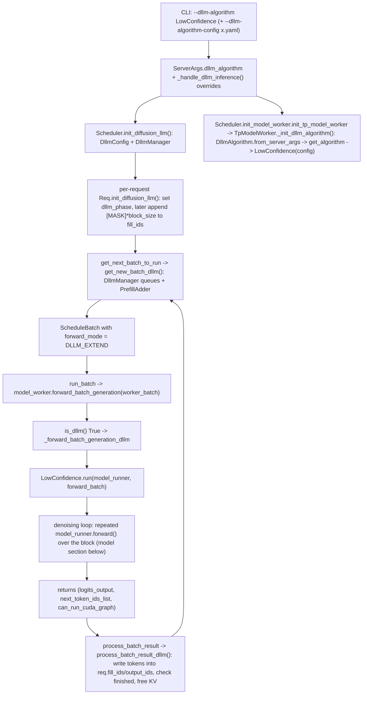
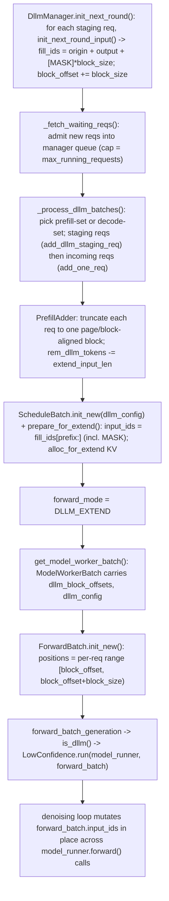
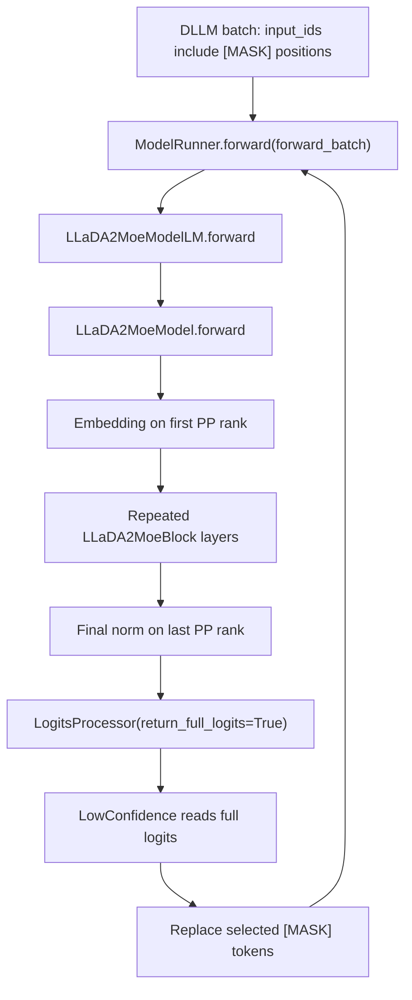
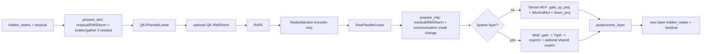
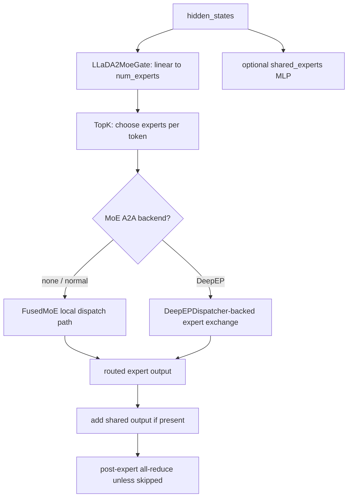
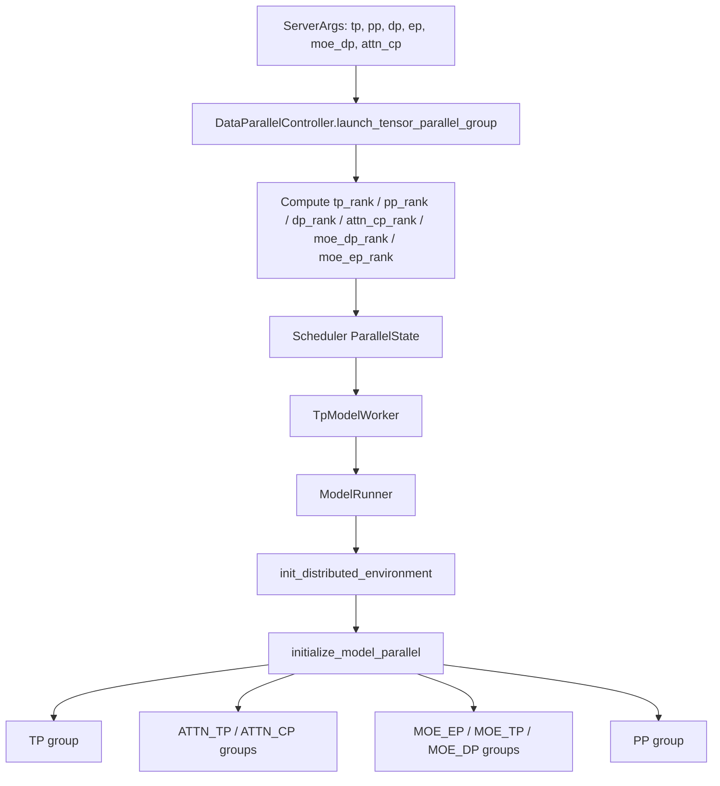
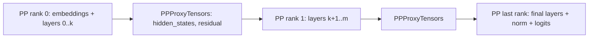

# LLaDA2 Model Workflow and Parallel Execution in SGLang

## Scope

This note explains two things. First (this added section) the **end-to-end call chain**: how the dLLM algorithm goes from a user CLI flag (`--dllm-algorithm LowConfidence`) all the way down to repeated `model_runner.forward()` calls. Second the SGLang-native LLaDA2 model itself once a request has reached `ModelRunner.forward()`, focusing on `python/sglang/srt/models/llada2.py`, then connecting that model workflow to TP, EP, PP, and DP execution.
The important framing is that LLaDA2 in this repo is used by a dLLM workflow: serving may repeatedly run forward passes over a masked block, and `LowConfidence` consumes full-position logits to fill masked tokens. The model itself is still a transformer-style forward graph, but the caller is not ordinary append-only next-token decoding.

## End-to-End Call Chain: From `--dllm-algorithm` to Execution

This is the full chain that surrounds the model `forward()`. The algorithm object (`LowConfidence`) lives in the **TP worker**, drives the denoising loop, and calls `model_runner.forward()` many times per block. The scheduler runs a separate dLLM batching path that produces `DLLM_EXTEND` batches with `[MASK]`-padded blocks.



### Stage 1 — CLI flag to ServerArgs and forced overrides

`--dllm-algorithm` / `--dllm-algorithm-config` are registered in the argument parser and stored as `ServerArgs.dllm_algorithm` (a plain string like `"LowConfidence"`) and `dllm_algorithm_config` (path to a YAML) (`python/sglang/srt/server_args.py:6329`, `python/sglang/srt/server_args.py:679`). When set, `_handle_dllm_inference()` rewrites several runtime settings so the denoising loop is safe and CUDA-graphable (`python/sglang/srt/server_args.py:4374`):

* Attention backend forced to `flashinfer` when CUDA graph is on (triton/aiter on HIP, ascend on NPU).
* `disable_overlap_schedule = True` — the overlap (future-token) scheduler is incompatible with the multi-forward block loop, so the worker takes the synchronous path.
* `disable_piecewise_cuda_graph = True` — the `with`-context inside the dLLM forward breaks dynamo (`python/sglang/srt/server_args.py:1337`).
* `page_size` set to `block_size`, hierarchical cache / LMCache disabled, `pp_size` forced to 1.

### Stage 2 — Two independent objects are built from one flag

The string flag fans out into two distinct objects on two layers:

| Layer     | Construction                                                 | Purpose                                                   |
| --------- | ------------------------------------------------------------ | --------------------------------------------------------- |
| Scheduler | `Scheduler.init_diffusion_llm()` builds `DllmConfig` + `DllmManager` (`python/sglang/srt/managers/scheduler.py:465`, mixin `python/sglang/srt/dllm/mixin/scheduler.py:21`) | Batching/queueing of dLLM requests.                       |
| TP worker | `TpModelWorker._init_dllm_algorithm()` -> `DllmAlgorithm.from_server_args` -> `get_algorithm(config)` -> `LowConfidence(config)` (`python/sglang/srt/managers/tp_worker.py:394`, `python/sglang/srt/dllm/algorithm/base.py:15`) | The actual denoising algorithm object that calls forward. |
|           |                                                              |                                                           |

`DllmConfig.from_server_args()` reads the model architecture and looks up a built-in `DLLM_PARAMS` table to get `block_size` and `mask_id` (e.g. `LLaDA2MoeModelLM` -> block_size 32, mask_id 156895), then optionally overrides `block_size` from the YAML (`python/sglang/srt/dllm/config.py:22`). `get_algorithm()` resolves the algorithm name through a dynamic registry: `import_algorithms()` scans `sglang/srt/dllm/algorithm/`, importing every module exposing an `Algorithm` symbol and mapping `Algorithm.__name__` to the class. `LowConfidence` is registered because `low_confidence.py:104` ends with `Algorithm = LowConfidence` (`python/sglang/srt/dllm/algorithm/__init__.py`). `LowConfidence.__init__` reads `threshold` (default 0.95) from `algorithm_config` (`python/sglang/srt/dllm/algorithm/low_confidence.py:14`).


### Stage 3 — Per-request setup and the `[MASK]` block

A new `Req` is built in `Scheduler.handle_generate_request()` (`python/sglang/srt/managers/scheduler.py:2024`) when a tokenized request arrives from the tokenizer process, then appended to the scheduler `waiting_queue` via `_add_request_to_queue()` (`python/sglang/srt/managers/scheduler.py:2264`). The constructor passes `dllm_config` through, so `Req.__init__` calls `init_diffusion_llm(dllm_config)` which sets the initial `dllm_phase` (`INCOMING_PREFILL` if the prompt is at least one block, else `INCOMING_DECODE`) (`python/sglang/srt/dllm/mixin/req.py:19`, called from `schedule_batch.py:908`). 

The `[MASK]` positions the algorithm later fills are created in `_init_fill_ids_for_dllm()`, which appends `[mask_id] * block_size` to `fill_ids` and advances `dllm_block_offset` (`python/sglang/srt/dllm/mixin/req.py:56`). `determine_dllm_phase()` decides per round whether the next block is a prefill (no mask in the block) or a decode/denoise block (mask present).

### Stage 4 — Scheduler builds a `DLLM_EXTEND` batch

`get_next_batch_to_run()` branches to `get_new_batch_dllm()` whenever `dllm_config` is set, instead of the normal prefill path (`python/sglang/srt/managers/scheduler.py:2498`, `python/sglang/srt/managers/scheduler.py:2574`). 

**That path pulls requests through the `DllmManager` waiting/staging queues,** allocates KV via a `PrefillAdder` constructed with `dllm_config`, separates staging vs incoming and prefill vs decode phases, and finally builds a `ScheduleBatch` with `forward_mode = ForwardMode.DLLM_EXTEND` (`python/sglang/srt/dllm/mixin/scheduler.py:29`, `:149`, `:209`). 

- `DLLM_EXTEND` classifies as an extend mode and as CUDA-graph-eligible (`python/sglang/srt/model_executor/forward_batch_info.py:106`, `:119`, `:171`).

### Stage 5 — run_batch dispatches to the worker, which dispatches to the algorithm

Because overlap is disabled, `run_batch()` takes the synchronous else-branch and calls `model_worker.forward_batch_generation(worker_batch)` (`python/sglang/srt/managers/scheduler.py:3084`). Inside the worker, `forward_batch_generation()` checks `is_dllm()` first and routes to `_forward_batch_generation_dllm()`, which calls `self.dllm_algorithm.run(self.model_runner, forward_batch)` (`python/sglang/srt/managers/tp_worker.py:468`, `:435`). This is the single hand-off point from generic SGLang serving into the dLLM algorithm.

### Stage 6 — `LowConfidence.run`: the denoising loop (entry to the model section)

`LowConfidence.run()` is where the block is actually denoised (`python/sglang/srt/dllm/algorithm/low_confidence.py:23`):

* Fast path: if the batch has no `mask_id` tokens, do one `model_runner.forward()` (pure prefill, populate KV) and return empty `next_token_ids`.
* Otherwise, loop up to `block_size` times: each iteration calls `model_runner.forward()`, reads `logits_output.full_logits` per block, takes `argmax` + softmax confidence, and commits masked positions whose confidence exceeds `threshold` (or the single most-confident position if none clear the bar). Committed tokens overwrite the `[MASK]` entries in `forward_batch.input_ids` in place, so the next forward sees fewer masks.
* A final `model_runner.forward()` produces the output, and tokens are reshaped into a per-request list (variable length) returned as `next_token_ids_list`.
  Each `model_runner.forward()` here is exactly the entry point the model section below documents. The denoising loop means TP/EP/PP/DP collectives fire once **per iteration**, not once per emitted token.

### Stage 7 — Result processing back in the scheduler

`process_batch_result()` routes extend-mode dLLM batches to `process_batch_result_dllm()` (`python/sglang/srt/managers/scheduler.py:3186`, mixin `python/sglang/srt/dllm/mixin/scheduler.py:63`). For each request it writes the returned tokens into the tail of `req.fill_ids`, extends `req.output_ids`, runs `check_finished`, and releases KV for finished requests, then streams output. The loop returns to Stage 4 for the next block.

### Anchor Summary

| Stage                             | File reference                                               |
| --------------------------------- | ------------------------------------------------------------ |
| CLI flag definition               | `python/sglang/srt/server_args.py:6329`                      |
| Forced runtime overrides          | `python/sglang/srt/server_args.py:4374`                      |
| Scheduler config/manager          | `python/sglang/srt/managers/scheduler.py:465`, `python/sglang/srt/dllm/mixin/scheduler.py:21` |
| Worker algorithm instantiation    | `python/sglang/srt/managers/tp_worker.py:394`                |
| Algorithm registry                | `python/sglang/srt/dllm/algorithm/__init__.py`, `python/sglang/srt/dllm/algorithm/low_confidence.py:104` |
| Config table (block_size/mask_id) | `python/sglang/srt/dllm/config.py:22`                        |
| Per-request mask block            | `python/sglang/srt/dllm/mixin/req.py:56`                     |
| dLLM batch construction           | `python/sglang/srt/managers/scheduler.py:2574`, `python/sglang/srt/dllm/mixin/scheduler.py:29` |
| run_batch -> worker               | `python/sglang/srt/managers/scheduler.py:3084`               |
| Worker -> algorithm hand-off      | `python/sglang/srt/managers/tp_worker.py:435`                |
| Denoising loop                    | `python/sglang/srt/dllm/algorithm/low_confidence.py:23`      |
| Result write-back                 | `python/sglang/srt/dllm/mixin/scheduler.py:63`               |

## Deep Dive: Scheduling and Constructing One dLLM Batch

This expands Stages 3–5 into a line-level walk-through of how a single `DLLM_EXTEND` batch is assembled and handed to the model. The dLLM scheduling path is deliberately a *separate* code path from normal prefill/decode: the unit of work is a fixed-size **block** of `block_size` tokens (32 for LLaDA2), and every scheduling round appends one fresh `[MASK]`-filled block per active request.

### Where a new `Req` is built and enters the scheduler

Before any of the queue logic below runs, a `Req` object has to exist. dLLM does **not** change this entry path — it is the standard SGLang request intake, with one extra argument (`dllm_config`) threaded into the constructor:

1. **Tokenizer process (async front end).** An HTTP/engine call lands in `TokenizerManager.generate_request()`, which tokenizes the prompt in `_tokenize_one_request()`, packs it into a `TokenizedGenerateReqInput`, and ships it over ZMQ via `_send_one_request()` → `send_to_scheduler` (`python/sglang/srt/managers/tokenizer_manager.py:515`, `:707`, `:1004`). At this point the request is just a tokenized message — there is no `Req` yet.
2. **Scheduler receives the message.** The scheduler's `event_loop_normal()` calls `recv_requests()` → `process_input_requests()`, and the `TypeBasedDispatcher` routes `TokenizedGenerateReqInput` to `handle_generate_request()` (`python/sglang/srt/managers/scheduler.py:1550`, `:1437`).
3. **The `Req` is constructed here.** `handle_generate_request()` builds `req = Req(...)`, passing `dllm_config=self.dllm_config` (the scheduler-side config from Stage 2) into the constructor (`python/sglang/srt/managers/scheduler.py:2024`). `Req.__init__` ends by calling `self.init_diffusion_llm(dllm_config)` (`python/sglang/srt/managers/schedule_batch.py:908`), which assigns the request's initial `dllm_phase` (`INCOMING_PREFILL`/`INCOMING_DECODE`) from prompt length vs `block_size` (`python/sglang/srt/dllm/mixin/req.py:19`). At construction time `fill_ids` is **not** yet masked — the `[MASK]` block is appended later, on the first `init_next_round_input()` (see below).
4. **Enqueue.** After multimodal/grammar handling, `handle_generate_request()` calls `_add_request_to_queue(req)`, which (in the non-disaggregated path) appends the `Req` to the scheduler's `waiting_queue` and stamps its wait-queue entry time (`python/sglang/srt/managers/scheduler.py:2220`, `:2257`, `:2264`).

So the lifecycle is: **tokenizer message → `handle_generate_request` builds the `Req` (with dLLM phase set) → scheduler `waiting_queue`**. Only afterward does `get_new_batch_dllm()` pull it into the `DllmManager` queues described next.

### Request lifecycle and the two queues

Once the `Req` is sitting in the scheduler's `waiting_queue`, the dLLM path takes over. `DllmManager` **holds two queues distinct from the scheduler's own `waiting_queue`** (`python/sglang/srt/dllm/mixin/scheduler.py:282`):

* `waiting_queue` — admitted dLLM requests, capped at `max_running_requests`.
* `staging_queue` — **requests that `PrefillAdder` allocated KV for in the current round.**

A request also carries a `dllm_phase` that is one of four values (`python/sglang/srt/dllm/mixin/req.py:12`):

| Phase                                  | Meaning                                                      |
| -------------------------------------- | ------------------------------------------------------------ |
| `INCOMING_PREFILL` / `INCOMING_DECODE` | First admission; set at `Req` construction from prompt length vs `block_size` (`mixin/req.py:19`). |
| `STAGING_PREFILL` / `STAGING_DECODE`   | Already admitted, recomputed each round by `determine_dllm_phase()` from whether the current block still contains `mask_id` (`mixin/req.py:40`). |

`PREFILL` vs `DECODE` is the dLLM-specific split: a **prefill** block is a block of the prompt that has no masks yet (just populate KV); a **decode** block is the trailing `[MASK]` block being denoised. `is_dllm_prefill()` treats both prefill phases as prefill (`mixin/req.py:34`).

### Step-by-step: `get_new_batch_dllm()`

The scheduler calls `get_new_batch_dllm()` instead of `get_new_batch_prefill()` whenever `dllm_config` is set (`python/sglang/srt/managers/scheduler.py:2574`). 

The body (`python/sglang/srt/dllm/mixin/scheduler.py:29`) runs in order:

1. **`_should_skip_prefill()`** — early-out if both manager queues are empty and nothing is waiting / no allocatable slots (`mixin/scheduler.py:115`).
2. **`_create_dllm_prefill_adder()`** — builds a `PrefillAdder` with `dllm_config`, which sets `rem_dllm_tokens = max_running_requests * block_size` as the per-round token budget (`mixin/scheduler.py:133`, `schedule_policy.py:483`).
3. **`dllm_manager.init_next_round()`** — for every request still in `staging_queue` from the previous round, call `req.init_next_round_input()` (no tree cache), then clear the staging queue (`mixin/scheduler.py:349`). 
   - This is the step that **grows the sequence by one block**: `_init_fill_ids_for_dllm()` rebuilds `fill_ids = origin_input_ids + output_ids + [mask_id] * block_size` and advances `dllm_block_offset += block_size` (`mixin/req.py:56`). 
   - So each round the committed tokens from the previous block become part of `output_ids`, and a brand-new masked block is appended at the tail.
4. **`_fetch_waiting_reqs()`** — pull up to `max_running_requests - len(manager.waiting_queue)` new requests from the scheduler's `waiting_queue` into the manager's `waiting_queue` (`mixin/scheduler.py:103`).
5. **`_process_dllm_batches(adder)`** — choose prefill or decode for this round (`mixin/scheduler.py:149`). It prefers prefill: **if any queued request `is_dllm_prefill()`, process those; otherwise process decode requests.** Within the chosen set, `_process_batch_by_phase()` handles **staging requests first** (they already hold resources from a prior round, admitted via `add_dllm_staging_req`) then **incoming requests** (new, admitted via `add_one_req`).
6. **`_update_state_for_batch()`** — push `can_run_list` into the staging queue and bump `is_chunked` (`mixin/scheduler.py:192`).
7. **`_create_dllm_batch()`** — `ScheduleBatch.init_new(..., dllm_config=...)`, then `prepare_for_extend()`, then force `forward_mode = DLLM_EXTEND` and `decoding_reqs = None` (`mixin/scheduler.py:209`).

### How KV budget and block truncation work in `PrefillAdder`

Two admission paths, both ultimately truncate the request to a single block aligned to `page_size` (and recall `page_size` was forced equal to `block_size`):

* **Incoming** (`add_one_req` → `_add_dllm_req`, `schedule_policy.py:618`): `trunc_len = min(rem_dllm_tokens, block_size) // page_size * page_size`; sets `req.extend_input_len = trunc_len` and truncates `fill_ids` to `prefix_len + trunc_len`.
* **Staging** (`add_dllm_staging_req`, `schedule_policy.py:640`): `_rem_tokens = min(rem_dllm_tokens, block_size, rem_total_tokens)`; truncates `extend_input_len`/`fill_ids` to that, reserves `max_new_tokens` only if not truncated.

Each admission calls `_update_prefill_budget()`, which decrements `rem_dllm_tokens -= extend_input_len` (`schedule_policy.py:599`). `budget_state()` returns `NO_TOKEN`/`OTHER` once `rem_dllm_tokens <= 0`, so the round admits at most `max_running_requests` blocks total (`schedule_policy.py:575`). This is why the per-round batch is bounded and block-aligned.

### `prepare_for_extend()`: from `fill_ids` to device tensors

`prepare_for_extend()` (`python/sglang/srt/managers/schedule_batch.py:1688`) sets `forward_mode = DLLM_EXTEND` for dLLM, then builds the extend tensors exactly like a normal extend:

* `input_ids = [r.fill_ids[len(r.prefix_indices):] for r in reqs]` — the **new (un-cached) tail of each request, including the `[MASK]` tokens**, flattened across the batch. This is the literal tensor the model sees: real prompt/decoded ids plus `mask_id` integers at masked positions.
* `seq_lens = [len(r.fill_ids)]`, `prefix_lens`, `extend_lens = [r.extend_input_len]`.
* `alloc_for_extend(self)` reserves KV slots (`out_cache_loc`) and `req_pool_indices`.

For a pure-mask decode block on an already-prefilled request, `prefix_indices` covers everything before the block, so `input_ids` is just the `block_size` mask tokens; for a prefill block it is the next `block_size` prompt tokens.

### `get_model_worker_batch()` → `ForwardBatch.init_new()`: the dLLM-specific positions

`get_model_worker_batch()` packs the batch into a `ModelWorkerBatch`, crucially carrying `dllm_block_offsets = [req.dllm_block_offset for req in reqs]` and `dllm_config` (`python/sglang/srt/managers/schedule_batch.py:2609`). `ForwardBatch.init_new()` then **overrides `positions`** for dLLM (`python/sglang/srt/model_executor/forward_batch_info.py:538`):

```python
ret.positions = torch.tensor(
    [i for block_offset in batch.dllm_block_offsets
       for i in range(block_offset, block_offset + block_size)],
    ...)
```

So each request's block occupies absolute positions `[block_offset, block_offset + block_size)`. This is what lets RoPE place the masked block at its correct location in the sequence even though the block is processed as one contiguous extend chunk. Contrast with normal extend, where positions are derived from `extend_seq_lens`/`extend_prefix_lens`. The attention metadata for `DLLM_EXTEND` is still built as an extend mode (`forward_batch_info.py:119`), and the model runs `RadixAttention` in `ENCODER_ONLY` mode so all positions in the block attend to each other and to the cached prefix.

### Feed to the model

`run_batch()` calls `batch.get_model_worker_batch()` and (overlap disabled) hands it to `model_worker.forward_batch_generation(worker_batch)` (`python/sglang/srt/managers/scheduler.py:3027`, `:3084`). 

The worker **builds the `ForwardBatch` via `ForwardBatch.init_new(model_worker_batch, model_runner)` (`python/sglang/srt/managers/tp_worker.py:463`)**, detects `is_dllm()`, and calls `LowConfidence.run(model_runner, forward_batch)`.

 From here the denoising loop (Stage 6) repeatedly calls `model_runner.forward(forward_batch)` over **this same** `forward_batch`, mutating `forward_batch.input_ids` in place as masks are committed, until the block is fully denoised or `block_size` iterations elapse.


### Batch-construction diagram



### Anchor Summary (batch construction)

| Step                      | File reference                                               |
| ------------------------- | ------------------------------------------------------------ |
| Two manager queues        | `python/sglang/srt/dllm/mixin/scheduler.py:282`              |
| Per-round block append    | `python/sglang/srt/dllm/mixin/req.py:56`, `python/sglang/srt/managers/schedule_batch.py:982` |
| Phase recompute           | `python/sglang/srt/dllm/mixin/req.py:40`                     |
| `get_new_batch_dllm` body | `python/sglang/srt/dllm/mixin/scheduler.py:29`               |
| Round budget init         | `python/sglang/srt/managers/schedule_policy.py:483`          |
| Incoming admission        | `python/sglang/srt/managers/schedule_policy.py:618`          |
| Staging admission         | `python/sglang/srt/managers/schedule_policy.py:640`          |
| Budget decrement / gate   | `python/sglang/srt/managers/schedule_policy.py:599`, `:575`  |
| Extend tensor build       | `python/sglang/srt/managers/schedule_batch.py:1688`          |
| Worker-batch pack         | `python/sglang/srt/managers/schedule_batch.py:2609`          |
| dLLM positions override   | `python/sglang/srt/model_executor/forward_batch_info.py:538` |
| Feed to worker/model      | `python/sglang/srt/managers/scheduler.py:3084`, `python/sglang/srt/managers/tp_worker.py:463` |


## One-Screen Mental Model



Code anchors:

| Component                    | File reference                           | Role                                                         |
| ---------------------------- | ---------------------------------------- | ------------------------------------------------------------ |
| Native model entry class     | `python/sglang/srt/models/llada2.py:772` | `LLaDA2MoeModelLM` is the SGLang model wrapper.              |
| Full-logits output           | `python/sglang/srt/models/llada2.py:803` | Required because dLLM token choice reads logits at many masked positions. |
| Inner model                  | `python/sglang/srt/models/llada2.py:683` | Embeddings, PP layer partition, final norm.                  |
| Transformer block            | `python/sglang/srt/models/llada2.py:566` | Attention + dense MLP or sparse MoE.                         |
| Attention                    | `python/sglang/srt/models/llada2.py:424` | QKV, QK norm, RoPE, encoder-only radix attention, output projection. |
| Sparse MoE                   | `python/sglang/srt/models/llada2.py:185` | Router, top-k expert choice, routed experts, optional shared expert. |
| EntryClass registration hook | `python/sglang/srt/models/llada2.py:953` | Registry imports this module and registers `LLaDA2MoeModelLM`. |

## Model Object Layout

```text
LLaDA2MoeModelLM
  +- model: LLaDA2MoeModel
  |  +- word_embeddings: VocabParallelEmbedding      only on PP first rank
  |  +- layers[start_layer:end_layer]: LLaDA2MoeBlock local PP layer slice
  |  +- norm: RMSNorm                                only on PP last rank
  +- lm_head: ParallelLMHead or tied word embedding
  +- logits_processor: LogitsProcessor(return_full_logits=True)
```

`LLaDA2MoeModelLM.__init__()` creates the inner model, the LM head, and `LogitsProcessor(return_full_logits=True)` (`python/sglang/srt/models/llada2.py:772`, `python/sglang/srt/models/llada2.py:803`). The full-logits setting is not cosmetic: `LowConfidence` needs logits for all block positions, then chooses which masked positions to accept.
`LLaDA2MoeModel.__init__()` is PP-aware. It creates embeddings only on the first pipeline rank, uses `make_layers()` to keep only the local layer interval, and creates final norm only on the last pipeline rank (`python/sglang/srt/models/llada2.py:698`, `python/sglang/srt/models/llada2.py:710`).

## Forward Call Chain

```text
LowConfidence.run(...)
  -> model_runner.forward(forward_batch)
     -> ModelRunner._forward_raw(...)
        -> ModelRunner.forward_extend(...) for DLLM_EXTEND / extend-like modes
           -> self.model.forward(input_ids, positions, forward_batch, ...)
              -> LLaDA2MoeModelLM.forward(...)
                 -> LLaDA2MoeModel.forward(...)
                    -> LLaDA2MoeBlock.forward(...) for each local layer
                       -> LayerCommunicator.prepare_attn(...)
                       -> LLaDA2MoeAttention.forward(...)
                       -> LayerCommunicator.prepare_mlp(...)
                       -> dense LLaDA2MoeMLP or sparse LLaDA2MoeSparseMoeBlock
                       -> LayerCommunicator.postprocess_layer(...)
                 -> LogitsProcessor(..., return_full_logits=True) on last PP rank
```

Code anchors:

| Step                                 | File reference                                          |
| ------------------------------------ | ------------------------------------------------------- |
| `ModelRunner.forward` wrapper        | `python/sglang/srt/model_executor/model_runner.py:3281` |
| `_forward_raw` mode dispatch         | `python/sglang/srt/model_executor/model_runner.py:3361` |
| `forward_extend` calls model forward | `python/sglang/srt/model_executor/model_runner.py:3160` |
| LLaDA2 LM forward                    | `python/sglang/srt/models/llada2.py:824`                |
| LLaDA2 inner-model forward           | `python/sglang/srt/models/llada2.py:727`                |
| Per-block forward                    | `python/sglang/srt/models/llada2.py:622`                |

## One Block, Visually



The block has communication boundaries around attention and MLP because the tensor layout may differ between attention, dense MLP, and MoE. `LayerScatterModes` chooses whether each part sees scattered tokens, full TP-attention data, full data, or MoE-full data (`python/sglang/srt/layers/communicator.py:156`, `python/sglang/srt/layers/communicator.py:222`).

## Attention Path

```text
LLaDA2MoeAttention.forward
  input hidden_states: [num_tokens_local_or_full, hidden_size]
  -> QKVParallelLinear
  -> split q/k/v
  -> optional q/k RMSNorm
  -> RoPE using positions
  -> RadixAttention(..., AttentionType.ENCODER_ONLY)
  -> RowParallelLinear output projection
```

Important code points:

| Behavior                                                     | File reference                           |
| ------------------------------------------------------------ | ---------------------------------------- |
| Attention TP size/rank read                                  | `python/sglang/srt/models/llada2.py:440` |
| Head divisibility checks                                     | `python/sglang/srt/models/llada2.py:442` |
| QKV sharded linear                                           | `python/sglang/srt/models/llada2.py:464` |
| Output row-parallel projection                               | `python/sglang/srt/models/llada2.py:480` |
| Encoder-only attention type                                  | `python/sglang/srt/models/llada2.py:508` |
| Forward QKV split / QK norm / RoPE / attention               | `python/sglang/srt/models/llada2.py:524` |
| The `AttentionType.ENCODER_ONLY` detail matters for dLLM interpretation: masked-token blocks are not necessarily append-only causal decode. The caller can run repeated full-block forward passes while replacing mask positions. |                                          |

## Sparse MoE Path



Important code points:

| Behavior                                                     | File reference                           |
| ------------------------------------------------------------ | ---------------------------------------- |
| Router gate                                                  | `python/sglang/srt/models/llada2.py:154` |
| Sparse block construction                                    | `python/sglang/srt/models/llada2.py:185` |
| TopK object                                                  | `python/sglang/srt/models/llada2.py:256` |
| MoE implementation chosen                                    | `python/sglang/srt/models/llada2.py:271` |
| Optional shared experts                                      | `python/sglang/srt/models/llada2.py:285` |
| DeepEP dispatcher                                            | `python/sglang/srt/models/llada2.py:304` |
| Normal MoE forward                                           | `python/sglang/srt/models/llada2.py:363` |
| DeepEP MoE forward                                           | `python/sglang/srt/models/llada2.py:393` |
| Post-expert TP all-reduce                                    | `python/sglang/srt/models/llada2.py:386` |
| Dense layers before `first_k_dense_replace` use `LLaDA2MoeMLP`; sparse layers use `LLaDA2MoeSparseMoeBlock` (`python/sglang/srt/models/llada2.py:603`, `python/sglang/srt/models/llada2.py:606`). |                                          |

## Weight Loading

```text
loader.load_model(...)
  -> construct LLaDA2MoeModelLM
  -> model.load_weights(weights)
     -> combine gate_proj/up_proj into gate_up_proj
     -> route expert gate/down/up weights through FusedMoE expert mapping
     -> call each param.weight_loader(...)
     -> record routed_experts_weights_of_layer for expert distribution tooling
```

`load_weights()` handles naming differences between Hugging Face checkpoint tensors and SGLang fused modules (`python/sglang/srt/models/llada2.py:849`). Expert weights are mapped through `FusedMoE.make_expert_params_mapping(...)`, then loaded only into matching parameters (`python/sglang/srt/models/llada2.py:857`).
Under EP, the lower-level `FusedMoE.weight_loader()` maps global expert IDs to local expert IDs and skips non-local expert weights (`python/sglang/srt/layers/moe/fused_moe_triton/layer.py:588`, `python/sglang/srt/layers/moe/fused_moe_triton/layer.py:598`).

## How It Executes Under TP/EP/PP/DP

### Launch Flags

| Parallelism  | Main flags                                                   | What it changes                                              |
| ------------ | ------------------------------------------------------------ | ------------------------------------------------------------ |
| TP           | `--tp-size`, `--tensor-parallel-size`                        | Shards linear layers, attention heads, LM head/vocab embedding, and TP collectives. |
| EP           | `--ep-size`, `--expert-parallel-size`, often `--moe-a2a-backend ...` | Shards routed MoE experts and adds expert token exchange.    |
| PP           | `--pp-size`, `--pipeline-parallel-size`                      | Splits transformer layers across pipeline ranks.             |
| Request DP   | `--dp-size` without DP attention                             | Replicates the model over independent DP workers; routes requests among them. |
| DP attention | `--dp-size --enable-dp-attention`                            | Folds attention data parallelism inside the TP world; attention sees fewer TP shards and local DP tokens. |
| MoE DP       | `--moe-dp-size`                                              | Adds data parallel dimension for MoE groups; constrained with EP/TP. |
|              |                                                              |                                                              |

Flag anchors: `--tp-size` and `--pp-size` are defined around `python/sglang/srt/server_args.py:5018` and `python/sglang/srt/server_args.py:5039`; `--dp-size` around `python/sglang/srt/server_args.py:5503`; `--ep-size` around `python/sglang/srt/server_args.py:5958`; `--enable-dp-attention` around `python/sglang/srt/server_args.py:6502`.


### Rank and Group Creation



Code anchors:

| Step                                         | File reference                                               |
| -------------------------------------------- | ------------------------------------------------------------ |
| Controller computes per-rank process layout  | `python/sglang/srt/managers/data_parallel_controller.py:449` |
| Attention/MoE hierarchy comment              | `python/sglang/srt/managers/data_parallel_controller.py:502` |
| Scheduler stores `ParallelState`             | `python/sglang/srt/managers/scheduler.py:391`                |
| Scheduler creates `TpModelWorker`            | `python/sglang/srt/managers/scheduler.py:661`                |
| `ModelRunner` initializes distributed groups | `python/sglang/srt/model_executor/model_runner.py:1240`, `python/sglang/srt/model_executor/model_runner.py:1250` |
| `initialize_model_parallel` group builder    | `python/sglang/srt/distributed/parallel_state.py:1755`       |

### TP: Tensor Parallel Execution

```text
Example: --tp-size 4, --pp-size 1, --dp-size 1

TP group: [rank0, rank1, rank2, rank3]

Each rank owns:
  - shard of QKVParallelLinear
  - shard of RowParallelLinear output projection
  - shard of dense MLP gate/up/down projections
  - shard of vocab embedding / LM head where applicable

Collectives:
  - attention/dense output reductions
  - post-MoE all-reduce in normal MoE path when needed
```

LLaDA2-specific TP hooks:

| Model code                         | TP effect                                                    |
| ---------------------------------- | ------------------------------------------------------------ |
| `VocabParallelEmbedding`           | Embedding table is vocab-parallel on first PP rank (`python/sglang/srt/models/llada2.py:698`). |
| `QKVParallelLinear`                | Q/K/V projections are sharded by attention TP (`python/sglang/srt/models/llada2.py:464`). |
| `RowParallelLinear`                | Attention output and MLP down projection are row-parallel (`python/sglang/srt/models/llada2.py:480`, `python/sglang/srt/models/llada2.py:122`). |
| `tensor_model_parallel_all_reduce` | Normal MoE path reduces routed expert output when needed (`python/sglang/srt/models/llada2.py:386`). |

### EP: Expert Parallel Execution

```text
Example: --tp-size 4 --ep-size 4 --moe-a2a-backend deepep

Global routed experts: E0 E1 E2 E3 ... E(N-1)

EP rank 0 owns a slice of experts
EP rank 1 owns a slice of experts
EP rank 2 owns a slice of experts
EP rank 3 owns a slice of experts

Each token:
  router -> TopK expert IDs -> token dispatch/all-to-all -> local expert compute -> combine
```

The EP group is built in `initialize_model_parallel()` using `expert_model_parallel_size` (`python/sglang/srt/distributed/parallel_state.py:1936`). `FusedMoE` reads `get_moe_expert_parallel_world_size()` and computes local routed experts (`python/sglang/srt/layers/moe/fused_moe_triton/layer.py:201`, `python/sglang/srt/layers/moe/fused_moe_triton/layer.py:214`). During checkpoint loading, non-local experts are skipped by local rank mapping (`python/sglang/srt/layers/moe/fused_moe_triton/layer.py:588`).
For DeepEP specifically, LLaDA2 creates a `DeepEPDispatcher` and sends expert traffic through that path (`python/sglang/srt/models/llada2.py:304`, `python/sglang/srt/models/llada2.py:393`). In this repo, DeepEP-style MoE forces `ep_size = tp_size` during argument normalization, so the common practical shape is `--tp-size N --ep-size N --moe-a2a-backend deepep`.

### PP: Pipeline Parallel Execution



PP changes where layers live, not the internal math of a layer:

* `get_pp_group()` determines first/last pipeline rank (`python/sglang/srt/models/llada2.py:683`).
* First PP rank owns `word_embeddings`; other PP ranks use `PPMissingLayer` (`python/sglang/srt/models/llada2.py:698`).
* `make_layers()` partitions `num_hidden_layers` by `pp_rank` and `pp_size` (`python/sglang/srt/models/llada2.py:710`).
* Non-last PP ranks return `PPProxyTensors({"hidden_states": ..., "residual": ...})`; last PP rank applies final norm and returns hidden states/logits (`python/sglang/srt/models/llada2.py:757`).
* `ModelRunner.forward_extend()` passes `pp_proxy_tensors` into model forward when the model supports PP (`python/sglang/srt/model_executor/model_runner.py:3160`).
  Example:

```bash
python -m sglang.launch_server \
  --model-path <LLaDA2-model-path> \
  --dllm-algorithm LowConfidence \
  --tp-size 4 \
  --pp-size 2 \
  --trust-remote-code
```

This creates a distributed world of `tp_size * pp_size = 8` ranks for one model replica. Inside each PP stage, layers still use TP/EP groups as configured.

### DP: Two Different Meanings in This Runtime

#### Request-Level DP

```text
Example: --dp-size 2 --tp-size 4 --pp-size 1, without --enable-dp-attention

DP0: TP group of 4 GPUs, complete model replica
DP1: TP group of 4 GPUs, complete model replica

Requests are routed to one DP worker group.
Model weights are replicated across DP groups.
```

`DataParallelController` launches separate tensor-parallel groups for DP workers when DP attention is not enabled (`python/sglang/srt/managers/data_parallel_controller.py:449`). This scales throughput and request concurrency but does not reduce memory for a single model replica. A 16B checkpoint that does not fit in one TP group will not be fixed by request-level DP alone.

#### DP Attention

```text
Example: --tp-size 8 --dp-size 2 --enable-dp-attention

Global TP world: 8 ranks
Attention DP size: 2
Attention TP size: tp_size / dp_size / attn_cp_size = 4

Effect:
  - attention work sees local DP-token slices
  - attention TP groups are smaller
  - gather/scatter/reduce-scatter moves tokens between DP-local and group-global layouts
```

Code anchors:

| Behavior                                                     | File reference                                               |
| ------------------------------------------------------------ | ------------------------------------------------------------ |
| `tp_size % dp_size == 0` check                               | `python/sglang/srt/server_args.py:3058`                      |
| DP attention world formula                                   | `python/sglang/srt/layers/dp_attention.py:240`               |
| DP attention initialization                                  | `python/sglang/srt/layers/dp_attention.py:274`               |
| Attention TP size accessor                                   | `python/sglang/srt/layers/dp_attention.py:330`               |
| DP gather/scatter helpers                                    | `python/sglang/srt/layers/dp_attention.py:534`, `python/sglang/srt/layers/dp_attention.py:550`, `python/sglang/srt/layers/dp_attention.py:572` |
| Layer scatter modes                                          | `python/sglang/srt/layers/communicator.py:156`, `python/sglang/srt/layers/communicator.py:222` |
| DP attention changes data layout inside a model replica; it is not the same as launching independent model replicas. For dLLM, it is especially important because `LowConfidence` may run multiple forward passes per block, so any gather/scatter overhead is paid repeatedly during the denoising loop. |                                                              |

### Combined Example Shapes

| Shape                                              | Total GPU interpretation                                    | What it helps                                               |
| -------------------------------------------------- | ----------------------------------------------------------- | ----------------------------------------------------------- |
| `--tp-size 4`                                      | 4 ranks, one PP stage                                       | First line of attack for memory.                            |
| `--tp-size 4 --ep-size 4 --moe-a2a-backend deepep` | 4 ranks, experts split across TP world                      | Reduces routed-expert residency per rank.                   |
| `--tp-size 4 --pp-size 2`                          | 8 ranks, two layer pipeline stages                          | Reduces per-rank layer residency.                           |
| `--dp-size 2 --tp-size 4`                          | 2 replicated 4-GPU model groups                             | Throughput, not single-replica memory.                      |
| `--tp-size 8 --dp-size 2 --enable-dp-attention`    | 8-rank model world with attention DP folded into TP         | Attention/token layout optimization inside one model world. |
| `--tp-size 8 --ep-size 8 --pp-size 2`              | 16-rank model world, two PP stages, EP across each TP stage | Large-model memory split plus MoE expert split.             |

## dLLM-Specific Execution Notes

* LLaDA2 returns full logits by construction; this is what lets `LowConfidence` inspect every masked position in the block.
* A single dLLM generation step may invoke multiple model forwards before emitting a block of tokens. TP/EP/PP/DP communication therefore happens per denoising iteration, not just once per output token.
* The model attention is `ENCODER_ONLY`, so do not assume ordinary causal next-token semantics unless a caller explicitly creates such a forward mode.
* Cache validity needs careful profiling/inspection for dLLM because masked positions are replaced in-place across iterations. The model code supports KV-cache plumbing through `RadixAttention`, but the dLLM algorithm changes token contents within a block.

## Practical Checklist

1. For memory: try TP first, then add EP for MoE, then PP if dense layers still do not fit.
2. For MoE: verify `num_experts` is divisible by EP size and use an EP-capable MoE backend.
3. For throughput: request-level DP helps only after one model replica fits.
4. For DP attention: treat `--tp-size` as the global in-replica rank count; attention TP becomes `tp_size / dp_size / attn_cp_size`.
5. For dLLM profiling: measure per-denoising-iteration latency and communication, not only final output tokens/sec.