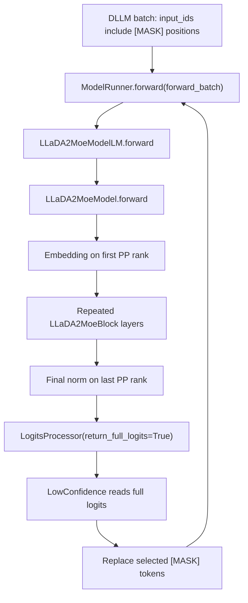
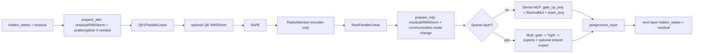
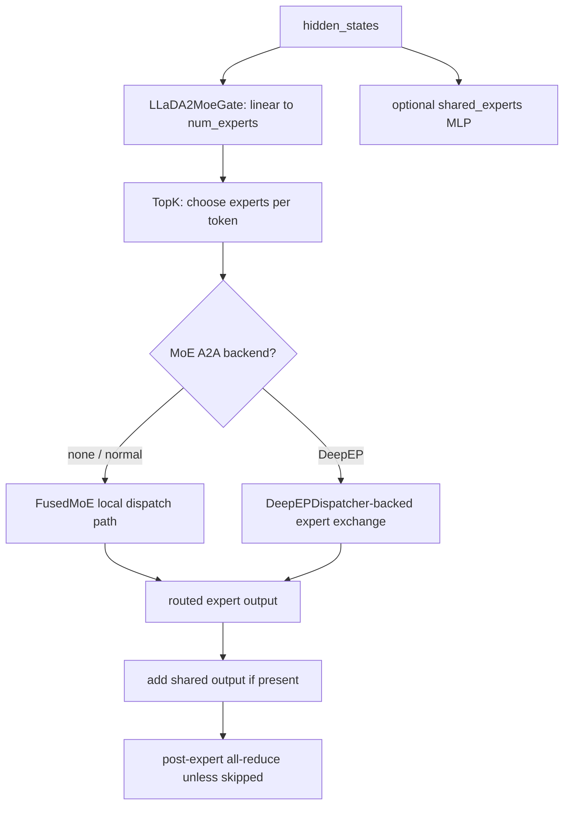
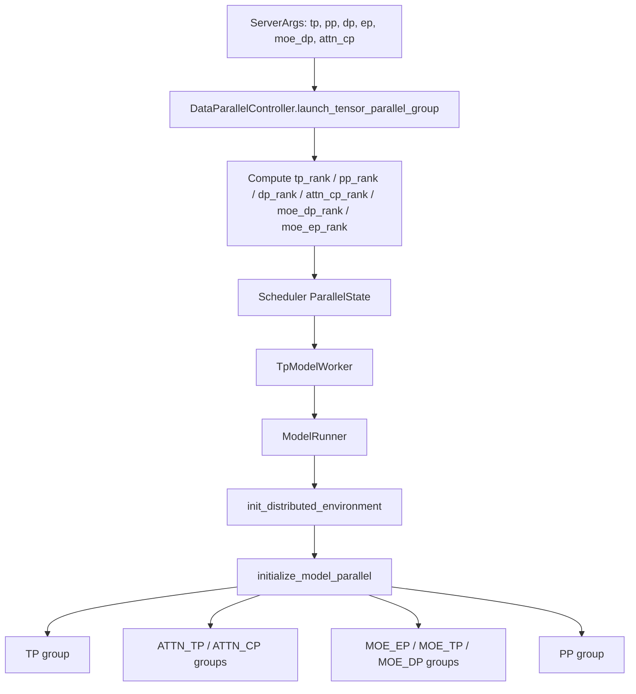
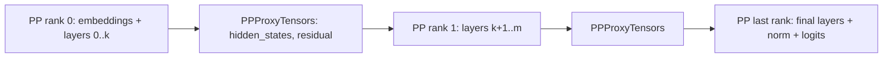

# LLaDA2 Model Workflow and Parallel Execution in SGLang
## Scope
This note explains how the SGLang-native LLaDA2 implementation executes after a request has reached `ModelRunner.forward()`. It focuses on `python/sglang/srt/models/llada2.py` and then connects that model workflow to TP, EP, PP, and DP execution.
The important framing is that LLaDA2 in this repo is used by a dLLM workflow: serving may repeatedly run forward passes over a masked block, and `LowConfidence` consumes full-position logits to fill masked tokens. The model itself is still a transformer-style forward graph, but the caller is not ordinary append-only next-token decoding.
## One-Screen Mental Model

Code anchors:
| Component | File reference | Role |
|---|---|---|
| Native model entry class | `python/sglang/srt/models/llada2.py:772` | `LLaDA2MoeModelLM` is the SGLang model wrapper. |
| Full-logits output | `python/sglang/srt/models/llada2.py:803` | Required because dLLM token choice reads logits at many masked positions. |
| Inner model | `python/sglang/srt/models/llada2.py:683` | Embeddings, PP layer partition, final norm. |
| Transformer block | `python/sglang/srt/models/llada2.py:566` | Attention + dense MLP or sparse MoE. |
| Attention | `python/sglang/srt/models/llada2.py:424` | QKV, QK norm, RoPE, encoder-only radix attention, output projection. |
| Sparse MoE | `python/sglang/srt/models/llada2.py:185` | Router, top-k expert choice, routed experts, optional shared expert. |
| EntryClass registration hook | `python/sglang/srt/models/llada2.py:953` | Registry imports this module and registers `LLaDA2MoeModelLM`. |
## Model Object Layout
```text
LLaDA2MoeModelLM
  +- model: LLaDA2MoeModel
  |  +- word_embeddings: VocabParallelEmbedding      only on PP first rank
  |  +- layers[start_layer:end_layer]: LLaDA2MoeBlock local PP layer slice
  |  +- norm: RMSNorm                                only on PP last rank
  +- lm_head: ParallelLMHead or tied word embedding
  +- logits_processor: LogitsProcessor(return_full_logits=True)
```
`LLaDA2MoeModelLM.__init__()` creates the inner model, the LM head, and `LogitsProcessor(return_full_logits=True)` (`python/sglang/srt/models/llada2.py:772`, `python/sglang/srt/models/llada2.py:803`). The full-logits setting is not cosmetic: `LowConfidence` needs logits for all block positions, then chooses which masked positions to accept.
`LLaDA2MoeModel.__init__()` is PP-aware. It creates embeddings only on the first pipeline rank, uses `make_layers()` to keep only the local layer interval, and creates final norm only on the last pipeline rank (`python/sglang/srt/models/llada2.py:698`, `python/sglang/srt/models/llada2.py:710`).
## Forward Call Chain
```text
LowConfidence.run(...)
  -> model_runner.forward(forward_batch)
     -> ModelRunner._forward_raw(...)
        -> ModelRunner.forward_extend(...) for DLLM_EXTEND / extend-like modes
           -> self.model.forward(input_ids, positions, forward_batch, ...)
              -> LLaDA2MoeModelLM.forward(...)
                 -> LLaDA2MoeModel.forward(...)
                    -> LLaDA2MoeBlock.forward(...) for each local layer
                       -> LayerCommunicator.prepare_attn(...)
                       -> LLaDA2MoeAttention.forward(...)
                       -> LayerCommunicator.prepare_mlp(...)
                       -> dense LLaDA2MoeMLP or sparse LLaDA2MoeSparseMoeBlock
                       -> LayerCommunicator.postprocess_layer(...)
                 -> LogitsProcessor(..., return_full_logits=True) on last PP rank
```
Code anchors:
| Step | File reference |
|---|---|
| `ModelRunner.forward` wrapper | `python/sglang/srt/model_executor/model_runner.py:3281` |
| `_forward_raw` mode dispatch | `python/sglang/srt/model_executor/model_runner.py:3361` |
| `forward_extend` calls model forward | `python/sglang/srt/model_executor/model_runner.py:3160` |
| LLaDA2 LM forward | `python/sglang/srt/models/llada2.py:824` |
| LLaDA2 inner-model forward | `python/sglang/srt/models/llada2.py:727` |
| Per-block forward | `python/sglang/srt/models/llada2.py:622` |
## One Block, Visually

The block has communication boundaries around attention and MLP because the tensor layout may differ between attention, dense MLP, and MoE. `LayerScatterModes` chooses whether each part sees scattered tokens, full TP-attention data, full data, or MoE-full data (`python/sglang/srt/layers/communicator.py:156`, `python/sglang/srt/layers/communicator.py:222`).
## Attention Path
```text
LLaDA2MoeAttention.forward
  input hidden_states: [num_tokens_local_or_full, hidden_size]
  -> QKVParallelLinear
  -> split q/k/v
  -> optional q/k RMSNorm
  -> RoPE using positions
  -> RadixAttention(..., AttentionType.ENCODER_ONLY)
  -> RowParallelLinear output projection
```
Important code points:
| Behavior | File reference |
|---|---|
| Attention TP size/rank read | `python/sglang/srt/models/llada2.py:440` |
| Head divisibility checks | `python/sglang/srt/models/llada2.py:442` |
| QKV sharded linear | `python/sglang/srt/models/llada2.py:464` |
| Output row-parallel projection | `python/sglang/srt/models/llada2.py:480` |
| Encoder-only attention type | `python/sglang/srt/models/llada2.py:508` |
| Forward QKV split / QK norm / RoPE / attention | `python/sglang/srt/models/llada2.py:524` |
The `AttentionType.ENCODER_ONLY` detail matters for dLLM interpretation: masked-token blocks are not necessarily append-only causal decode. The caller can run repeated full-block forward passes while replacing mask positions.
## Sparse MoE Path

Important code points:
| Behavior | File reference |
|---|---|
| Router gate | `python/sglang/srt/models/llada2.py:154` |
| Sparse block construction | `python/sglang/srt/models/llada2.py:185` |
| TopK object | `python/sglang/srt/models/llada2.py:256` |
| MoE implementation chosen | `python/sglang/srt/models/llada2.py:271` |
| Optional shared experts | `python/sglang/srt/models/llada2.py:285` |
| DeepEP dispatcher | `python/sglang/srt/models/llada2.py:304` |
| Normal MoE forward | `python/sglang/srt/models/llada2.py:363` |
| DeepEP MoE forward | `python/sglang/srt/models/llada2.py:393` |
| Post-expert TP all-reduce | `python/sglang/srt/models/llada2.py:386` |
Dense layers before `first_k_dense_replace` use `LLaDA2MoeMLP`; sparse layers use `LLaDA2MoeSparseMoeBlock` (`python/sglang/srt/models/llada2.py:603`, `python/sglang/srt/models/llada2.py:606`).
## Weight Loading
```text
loader.load_model(...)
  -> construct LLaDA2MoeModelLM
  -> model.load_weights(weights)
     -> combine gate_proj/up_proj into gate_up_proj
     -> route expert gate/down/up weights through FusedMoE expert mapping
     -> call each param.weight_loader(...)
     -> record routed_experts_weights_of_layer for expert distribution tooling
```
`load_weights()` handles naming differences between Hugging Face checkpoint tensors and SGLang fused modules (`python/sglang/srt/models/llada2.py:849`). Expert weights are mapped through `FusedMoE.make_expert_params_mapping(...)`, then loaded only into matching parameters (`python/sglang/srt/models/llada2.py:857`).
Under EP, the lower-level `FusedMoE.weight_loader()` maps global expert IDs to local expert IDs and skips non-local expert weights (`python/sglang/srt/layers/moe/fused_moe_triton/layer.py:588`, `python/sglang/srt/layers/moe/fused_moe_triton/layer.py:598`).
## How It Executes Under TP/EP/PP/DP
### Launch Flags
| Parallelism | Main flags | What it changes |
|---|---|---|
| TP | `--tp-size`, `--tensor-parallel-size` | Shards linear layers, attention heads, LM head/vocab embedding, and TP collectives. |
| EP | `--ep-size`, `--expert-parallel-size`, often `--moe-a2a-backend ...` | Shards routed MoE experts and adds expert token exchange. |
| PP | `--pp-size`, `--pipeline-parallel-size` | Splits transformer layers across pipeline ranks. |
| Request DP | `--dp-size` without DP attention | Replicates the model over independent DP workers; routes requests among them. |
| DP attention | `--dp-size --enable-dp-attention` | Folds attention data parallelism inside the TP world; attention sees fewer TP shards and local DP tokens. |
| MoE DP | `--moe-dp-size` | Adds data parallel dimension for MoE groups; constrained with EP/TP. |
Flag anchors: `--tp-size` and `--pp-size` are defined around `python/sglang/srt/server_args.py:5018` and `python/sglang/srt/server_args.py:5039`; `--dp-size` around `python/sglang/srt/server_args.py:5503`; `--ep-size` around `python/sglang/srt/server_args.py:5958`; `--enable-dp-attention` around `python/sglang/srt/server_args.py:6502`.
### Rank and Group Creation

Code anchors:
| Step | File reference |
|---|---|
| Controller computes per-rank process layout | `python/sglang/srt/managers/data_parallel_controller.py:449` |
| Attention/MoE hierarchy comment | `python/sglang/srt/managers/data_parallel_controller.py:502` |
| Scheduler stores `ParallelState` | `python/sglang/srt/managers/scheduler.py:391` |
| Scheduler creates `TpModelWorker` | `python/sglang/srt/managers/scheduler.py:661` |
| `ModelRunner` initializes distributed groups | `python/sglang/srt/model_executor/model_runner.py:1240`, `python/sglang/srt/model_executor/model_runner.py:1250` |
| `initialize_model_parallel` group builder | `python/sglang/srt/distributed/parallel_state.py:1755` |
### TP: Tensor Parallel Execution
```text
Example: --tp-size 4, --pp-size 1, --dp-size 1

TP group: [rank0, rank1, rank2, rank3]

Each rank owns:
  - shard of QKVParallelLinear
  - shard of RowParallelLinear output projection
  - shard of dense MLP gate/up/down projections
  - shard of vocab embedding / LM head where applicable

Collectives:
  - attention/dense output reductions
  - post-MoE all-reduce in normal MoE path when needed
```
LLaDA2-specific TP hooks:
| Model code | TP effect |
|---|---|
| `VocabParallelEmbedding` | Embedding table is vocab-parallel on first PP rank (`python/sglang/srt/models/llada2.py:698`). |
| `QKVParallelLinear` | Q/K/V projections are sharded by attention TP (`python/sglang/srt/models/llada2.py:464`). |
| `RowParallelLinear` | Attention output and MLP down projection are row-parallel (`python/sglang/srt/models/llada2.py:480`, `python/sglang/srt/models/llada2.py:122`). |
| `tensor_model_parallel_all_reduce` | Normal MoE path reduces routed expert output when needed (`python/sglang/srt/models/llada2.py:386`). |
### EP: Expert Parallel Execution
```text
Example: --tp-size 4 --ep-size 4 --moe-a2a-backend deepep

Global routed experts: E0 E1 E2 E3 ... E(N-1)

EP rank 0 owns a slice of experts
EP rank 1 owns a slice of experts
EP rank 2 owns a slice of experts
EP rank 3 owns a slice of experts

Each token:
  router -> TopK expert IDs -> token dispatch/all-to-all -> local expert compute -> combine
```
The EP group is built in `initialize_model_parallel()` using `expert_model_parallel_size` (`python/sglang/srt/distributed/parallel_state.py:1936`). `FusedMoE` reads `get_moe_expert_parallel_world_size()` and computes local routed experts (`python/sglang/srt/layers/moe/fused_moe_triton/layer.py:201`, `python/sglang/srt/layers/moe/fused_moe_triton/layer.py:214`). During checkpoint loading, non-local experts are skipped by local rank mapping (`python/sglang/srt/layers/moe/fused_moe_triton/layer.py:588`).
For DeepEP specifically, LLaDA2 creates a `DeepEPDispatcher` and sends expert traffic through that path (`python/sglang/srt/models/llada2.py:304`, `python/sglang/srt/models/llada2.py:393`). In this repo, DeepEP-style MoE forces `ep_size = tp_size` during argument normalization, so the common practical shape is `--tp-size N --ep-size N --moe-a2a-backend deepep`.
### PP: Pipeline Parallel Execution

PP changes where layers live, not the internal math of a layer:
* `get_pp_group()` determines first/last pipeline rank (`python/sglang/srt/models/llada2.py:683`).
* First PP rank owns `word_embeddings`; other PP ranks use `PPMissingLayer` (`python/sglang/srt/models/llada2.py:698`).
* `make_layers()` partitions `num_hidden_layers` by `pp_rank` and `pp_size` (`python/sglang/srt/models/llada2.py:710`).
* Non-last PP ranks return `PPProxyTensors({"hidden_states": ..., "residual": ...})`; last PP rank applies final norm and returns hidden states/logits (`python/sglang/srt/models/llada2.py:757`).
* `ModelRunner.forward_extend()` passes `pp_proxy_tensors` into model forward when the model supports PP (`python/sglang/srt/model_executor/model_runner.py:3160`).
Example:
```bash
python -m sglang.launch_server \
  --model-path <LLaDA2-model-path> \
  --dllm-algorithm LowConfidence \
  --tp-size 4 \
  --pp-size 2 \
  --trust-remote-code
```
This creates a distributed world of `tp_size * pp_size = 8` ranks for one model replica. Inside each PP stage, layers still use TP/EP groups as configured.
### DP: Two Different Meanings in This Runtime
#### Request-Level DP
```text
Example: --dp-size 2 --tp-size 4 --pp-size 1, without --enable-dp-attention

DP0: TP group of 4 GPUs, complete model replica
DP1: TP group of 4 GPUs, complete model replica

Requests are routed to one DP worker group.
Model weights are replicated across DP groups.
```
`DataParallelController` launches separate tensor-parallel groups for DP workers when DP attention is not enabled (`python/sglang/srt/managers/data_parallel_controller.py:449`). This scales throughput and request concurrency but does not reduce memory for a single model replica. A 16B checkpoint that does not fit in one TP group will not be fixed by request-level DP alone.
#### DP Attention
```text
Example: --tp-size 8 --dp-size 2 --enable-dp-attention

Global TP world: 8 ranks
Attention DP size: 2
Attention TP size: tp_size / dp_size / attn_cp_size = 4

Effect:
  - attention work sees local DP-token slices
  - attention TP groups are smaller
  - gather/scatter/reduce-scatter moves tokens between DP-local and group-global layouts
```
Code anchors:
| Behavior | File reference |
|---|---|
| `tp_size % dp_size == 0` check | `python/sglang/srt/server_args.py:3058` |
| DP attention world formula | `python/sglang/srt/layers/dp_attention.py:240` |
| DP attention initialization | `python/sglang/srt/layers/dp_attention.py:274` |
| Attention TP size accessor | `python/sglang/srt/layers/dp_attention.py:330` |
| DP gather/scatter helpers | `python/sglang/srt/layers/dp_attention.py:534`, `python/sglang/srt/layers/dp_attention.py:550`, `python/sglang/srt/layers/dp_attention.py:572` |
| Layer scatter modes | `python/sglang/srt/layers/communicator.py:156`, `python/sglang/srt/layers/communicator.py:222` |
DP attention changes data layout inside a model replica; it is not the same as launching independent model replicas. For dLLM, it is especially important because `LowConfidence` may run multiple forward passes per block, so any gather/scatter overhead is paid repeatedly during the denoising loop.
### Combined Example Shapes
| Shape | Total GPU interpretation | What it helps |
|---|---|---|
| `--tp-size 4` | 4 ranks, one PP stage | First line of attack for memory. |
| `--tp-size 4 --ep-size 4 --moe-a2a-backend deepep` | 4 ranks, experts split across TP world | Reduces routed-expert residency per rank. |
| `--tp-size 4 --pp-size 2` | 8 ranks, two layer pipeline stages | Reduces per-rank layer residency. |
| `--dp-size 2 --tp-size 4` | 2 replicated 4-GPU model groups | Throughput, not single-replica memory. |
| `--tp-size 8 --dp-size 2 --enable-dp-attention` | 8-rank model world with attention DP folded into TP | Attention/token layout optimization inside one model world. |
| `--tp-size 8 --ep-size 8 --pp-size 2` | 16-rank model world, two PP stages, EP across each TP stage | Large-model memory split plus MoE expert split. |
## dLLM-Specific Execution Notes
* LLaDA2 returns full logits by construction; this is what lets `LowConfidence` inspect every masked position in the block.
* A single dLLM generation step may invoke multiple model forwards before emitting a block of tokens. TP/EP/PP/DP communication therefore happens per denoising iteration, not just once per output token.
* The model attention is `ENCODER_ONLY`, so do not assume ordinary causal next-token semantics unless a caller explicitly creates such a forward mode.
* Cache validity needs careful profiling/inspection for dLLM because masked positions are replaced in-place across iterations. The model code supports KV-cache plumbing through `RadixAttention`, but the dLLM algorithm changes token contents within a block.
## Practical Checklist
1. For memory: try TP first, then add EP for MoE, then PP if dense layers still do not fit.
2. For MoE: verify `num_experts` is divisible by EP size and use an EP-capable MoE backend.
3. For throughput: request-level DP helps only after one model replica fits.
4. For DP attention: treat `--tp-size` as the global in-replica rank count; attention TP becomes `tp_size / dp_size / attn_cp_size`.
5. For dLLM profiling: measure per-denoising-iteration latency and communication, not only final output tokens/sec.
