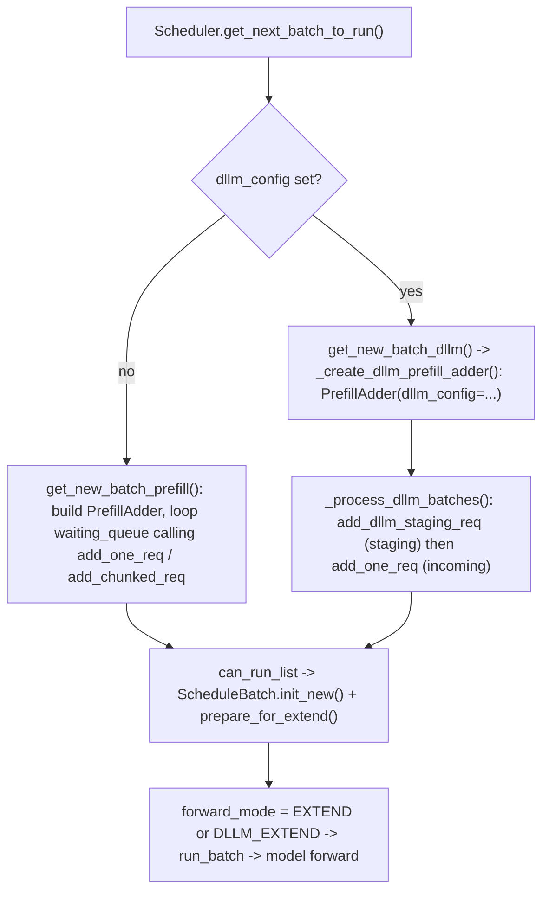
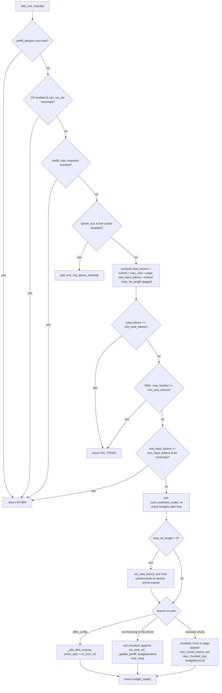
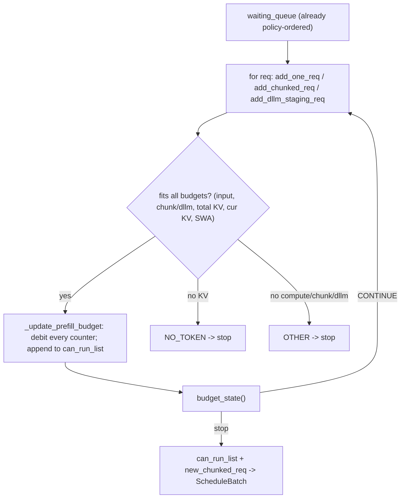

# PrefillAdder: One-Pass Admission Control in SGLang

## Scope

This note explains `PrefillAdder` in `python/sglang/srt/managers/schedule_policy.py:407`. `PrefillAdder` is the **per-scheduling-round admission controller**: given the waiting requests (already ordered by `SchedulePolicy`), it decides which of them can join the next forward batch, how much of each request to admit this round (full vs chunked vs one dLLM block), and stops as soon as a budget is exhausted. It is the object that turns "what order to serve" (the policy) into "what actually fits right now" (the batch).

The framing that matters for this repo: the **same** `PrefillAdder` class serves both ordinary autoregressive prefill and the dLLM block path. The dLLM path (`get_new_batch_dllm()`) constructs it with a `dllm_config` and then calls `add_one_req` / `add_dllm_staging_req`, which branch into the `_add_dllm_req` truncation logic. So understanding `PrefillAdder` is the bridge between the dLLM batch-construction walk-through in [[llada2_workflow_and_parallelism]] (Stages 4–5) and the actual KV/compute budgeting.

## Where PrefillAdder Fits

`PrefillAdder` is built fresh every scheduling round and discarded after the batch is formed. Two callers construct it:

The loop in the caller is: for each waiting `Req` (in policy order), call an `add_*` method; inspect the returned `AddReqResult`; on `CONTINUE` keep going, on `NO_TOKEN` / `OTHER` stop admitting. The admitted requests accumulate in `self.can_run_list`; an in-progress chunked request is held in `self.new_chunked_req`; preempted running requests collect in `self.preempt_list`.

## The Budget Model (the heart of the class)

`PrefillAdder` tracks several **independent budgets** simultaneously. A request is admitted only if it fits in *all* applicable budgets; the round stops when *any* of them is exhausted. There are two flavors: scalar counters decremented as requests are added, and computed properties that read live pool state.

| Budget | Kind | Meaning | Where decremented / computed |
| --- | --- | --- | --- |
| `rem_input_tokens` | counter | Prefill **compute** budget for this pass (≈ `max_prefill_tokens` minus mixed-decode tokens). Caps total extend tokens processed. | init `:431`, dec in `_update_prefill_budget` `:594` |
| `rem_chunk_tokens` | counter | Chunked-prefill budget (`chunked_prefill_size`); `None` ⇒ chunking disabled. Drives whether a request is truncated into a chunk. | init `:432`, dec `:601` |
| `rem_total_tokens` | property | **KV-memory** budget, *conservative*: `available + evictable − rem_total_token_offset`. Offset reserves `extend + max_new + page` per admitted/running req, i.e. room for the whole generation. | property `:498`, offset `:592` |
| `cur_rem_tokens` | property | **KV-memory** budget, *immediate*: same pool size minus `cur_rem_token_offset`, which reserves only `extend + page` (no decode lookahead). | property `:525`, offset `:593` |
| `rem_swa_tokens` | property | Sliding-window pool budget; only meaningful when `is_hybrid_swa`. | property `:517`, offset `:597` |
| `rem_dllm_tokens` | counter | **dLLM per-round** budget = `max_running_requests * block_size`. Caps the round to at most one block per running request. | init `:483`, dec `:600` |

### The two offsets — why both exist

The split between `rem_total_token_offset` and `cur_rem_token_offset` is the subtle part:
* `rem_total_token_offset` adds `extend_input_len + max_new_tokens + page_overhead` (`:592`). It answers *"if this request runs to completion, will its whole KV footprint fit?"* — a pessimistic reservation that prevents admitting work that will OOM mid-decode.
* `cur_rem_token_offset` adds only `extend_input_len + page_overhead` (`:593`). It answers *"can I allocate this request's prefill chunk **right now**?"* — the immediate physical allocation.

Both must stay positive (`budget_state` `:566`). `rem_total_tokens` gates over-admission; `cur_rem_tokens` gates the immediate alloc. For running requests, the lifetime reservation uses `_get_running_request_total_token_offset` (`:489`) = `min(max_new − generated, CLIP) * new_token_ratio` — `new_token_ratio` (<1) is the scheduler's dynamic estimate of how many tokens a request will *actually* emit, so the reservation is not the full `max_new_tokens` worst case.

### Pool-aware properties

`rem_total_tokens` / `cur_rem_tokens` / `rem_swa_tokens` branch on the allocator type (`:498`–`:543`):
* hybrid SWA (`SWATokenToKVPoolAllocator`, DeepSeek-V4 HiSparse) → `full_available_size() + full_evictable_size()` plus a separate SWA budget.
* hybrid SSM/Mamba cache → `available_size() + full_evictable_size()`.
* plain → `available_size() + evictable_size()`.
`evictable_size()` is included because admitting a request may evict cold prefix-cache nodes to reclaim their KV — so "free" includes "reclaimable".

## Construction

`__init__` (`:408`) snapshots everything the round needs:
* Pool/cache handles (`tree_cache`, `token_to_kv_pool_allocator`), the current `running_batch`, `new_token_ratio`.
* Initializes the counters above; if `dllm_config` is set, `_init_dllm_meta` (`:483`) sets `rem_dllm_tokens`.
* Seeds `rem_total_token_offset` with the lifetime reservation of every **already-running** request (`:451`) so new admissions account for in-flight decode memory.
* Detects pool flavor (`is_hybrid_swa`, `is_hybrid_ssm_cache`) and reads scheduling constraints (`max_running_requests`, `prefill_max_requests`, `max_prefill_bs`, CP single-request flags, the `prefill_delayer_single_pass` gate, `waiting_queue_len`).

## Admission Decision Flow — `add_one_req`

`add_one_req` (`:815`) is the main path for a brand-new (incoming) request. The order of checks is the logic to internalize:

Key details inside the flow:
* **`real_input_tokens = extend_input_len − host_hit_length`** (`:854`): tokens already resident in the host (CPU) cache tier don't count against the prefill *compute* budget, because they'll be copied back rather than recomputed.
* **`_lock_node` context manager** (`:703`): increments the tree-cache lock ref on the request's `last_node` for the duration of admission, so the matched prefix can't be evicted while we're deciding. Budgets are re-checked *after* the lock because `rem_total_tokens` can drop when a concurrent step frees/locks memory. For tree caches it mirrors the exact nodes via `to_dec_params()` so SWA/Mamba tombstones revived by `init_load_back` are released correctly.
* **`init_load_back`** (`:879`): when a prefix was found on the host tier, it's loaded to device, `prefix_indices` grows, and `extend_input_len` shrinks accordingly — the request now starts further along.
* **Three terminal branches**: dLLM block (`_add_dllm_req`), non-chunked full admission, or chunked truncation (`new_chunked_req` is set so the caller continues it next round).

## The Other Admission Entry Points

| Method | Caller / situation | What it does |
| --- | --- | --- |
| `add_one_req_ignore_eos` (`:720`) | `ignore_eos` + tree cache disabled | No prefix caching, so it can't rely on eviction. Builds `req_states` (sorted `(tokens_left, tokens_occupied)`) over the new req + running + already-admitted, then walks them to verify worst-case decode memory never goes negative before admitting. Conservative reservation for unbounded-length requests. |
| `add_chunked_req` (`:668`) | continuation of a chunk started in a prior round | Re-admits the in-flight chunked request; truncates `extend_input_len` to the remaining chunk/total budget. **Must** be appended even when `_rem_tokens <= 0` (except hybrid-SWA early return) to avoid a memory leak of its already-allocated slots. |
| `add_dllm_staging_req` (`:640`) | dLLM request that already holds KV from a previous block | Truncates to `_get_dllm_remain_tokens()` = `min(rem_dllm_tokens, block_size, rem_total_tokens)`; reserves `max_new_tokens` only if not truncated; returns `NO_TOKEN` once the dLLM budget is drained. |
| `_add_dllm_req` (`:618`) | helper for both incoming dLLM admission | `trunc_len = min(rem_dllm_tokens, block_size) // page_size * page_size`; sets `extend_input_len = trunc_len`, truncates `fill_ids` to `prefix_len + trunc_len`, budgets with `max_new = 0` (dLLM commits in fixed blocks, no decode lookahead). Recall `page_size == block_size` is forced for dLLM, so a block is exactly one page. |

## Budget Gating — `budget_state`

After every admission the caller checks `budget_state()` (`:565`):
* `NO_TOKEN` — any KV budget exhausted (`rem_total_tokens <= 0` or `cur_rem_tokens <= 0`, or `rem_swa_tokens <= 0` on SWA). Hard memory stop.
* `OTHER` — compute/chunk/dLLM budget exhausted (`rem_input_tokens <= 0`; or dLLM `rem_dllm_tokens <= 0`; or chunked `rem_chunk_tokens <= 0`). Soft stop: batch is "full enough".
* `CONTINUE` — keep admitting.

`_update_prefill_budget` (`:584`) is the single mutation point that all admission paths funnel through: it page-aligns `extend_input_len`, then debits `rem_total_token_offset`, `cur_rem_token_offset`, `rem_input_tokens`, the SWA offset, and either `rem_dllm_tokens` or `rem_chunk_tokens`, and updates the `log_hit_tokens` / `log_input_tokens` counters.

## Preemption — `preempt_to_schedule`

`preempt_to_schedule` (`:957`) is only used under priority scheduling. To admit a high-priority `req` that doesn't fit, it sorts running requests by *ascending* priority, marks the lowest-priority ones preemptible when `priority_diff > priority_scheduling_preemption_threshold`, and accumulates freed lifetime-reservation tokens until `min_tokens_to_remove <= 0`. If enough can be freed, it releases those requests' KV (`release_req`), filters them out of `running_batch`, and records them in `preempt_list`. The comment at `:965` flags the two-phase finish race: a running request may already have its KV freed (phase 1) but not yet be filtered from the batch (phase 2), so finished requests are skipped to avoid a double-free.

## dLLM-Specific Notes

* The dLLM budget `rem_dllm_tokens = max_running_requests * block_size` makes the round admit **at most one block per running request**, which is exactly the unit of work the denoising loop in [[llada2_workflow_and_parallelism]] consumes. There is no per-token decode reservation because a dLLM block is filled in place over repeated forwards, not appended token-by-token.
* `max_new_tokens` is reserved (`add_dllm_staging_req` `:654`) **only when the block is not truncated** — a truncated block will be continued next round, so reserving full decode space for it would double-count.
* dLLM admission asserts `truncation_align_size is None` (`:901`): the deterministic-attention chunk-alignment path is incompatible with fixed block truncation.
* `_get_dllm_remain_tokens` (`:607`) has a guard: if the `min(...)` collapses to ≤0 it falls back to `rem_dllm_tokens` so at least one block can be attempted (the FIXME at `:619` notes the `rem_dllm_tokens < block_size` case is still rough for the unmask process).

## Anchor Summary

| Concept | File reference |
| --- | --- |
| Class definition / constructor | `python/sglang/srt/managers/schedule_policy.py:407`, `:408` |
| dLLM budget init | `:483` |
| Running-request lifetime reservation | `:489` |
| `rem_total_tokens` / `cur_rem_tokens` / `rem_swa_tokens` properties | `:498`, `:525`, `:517` |
| `budget_state` gating | `:565` |
| `_update_prefill_budget` (single debit point) | `:584` |
| dLLM block admission helper | `:618` |
| dLLM staging admission | `:640` |
| Chunked-req continuation | `:668` |
| `_lock_node` context manager | `:703` |
| ignore_eos worst-case path | `:720` |
| `add_one_req` main path | `:815` |
| `init_load_back` host→device prefix | `:879` |
| Preemption | `:957` |
| `AddReqResult` enum | `:401` |

## One-Screen Mental Model

The mental shortcut: **`PrefillAdder` is a multi-budget greedy packer.** Policy decides order; `PrefillAdder` packs in that order against a KV-memory budget (two views: lifetime-conservative and immediate), a prefill-compute budget, an optional chunk budget, and — for dLLM — a per-round block budget, stopping at the first exhausted budget.
